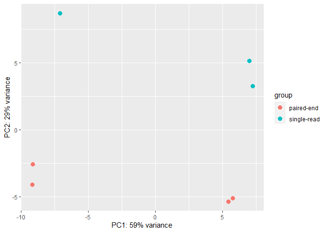



### 1）规一化表达矩阵

转录组差异表达分析时，需要对表达矩阵进行规一化。比较常用的方法有log2和DESeq2包的vst和rlog方法。那么它们有什么不一样呢？我们拿DESeq2的示例数据进行比较。

    library(RNAseqFlow)
    library(DESeq2)
    library(corrplot)
    input <- createCountPhe() # 得到表达矩阵和表型信息
    expr <- input[[1]]
    phe <- input[[2]]
    dds <- create_DEseq(count_data=expr,col_data=phe,design_names = "condition+type",group_name ="condition",ref_level = "untreated") # 创建DESeqDataSet对象
    
    ## [1] "The id order between gene count file and phenotype file is identical without modification!"
    
    dds
    
    ## class: DESeqDataSet 
    ## dim: 10089 7 
    ## metadata(1): version
    ## assays(4): counts mu H cooks
    ## rownames(10089): FBgn0000008 FBgn0000017 ... FBgn0261574 FBgn0261575
    ## rowData names(26): baseMean baseVar ... deviance maxCooks
    ## colnames(7): treated1 treated2 ... untreated3 untreated4
    ## colData names(3): condition type sizeFactor
    
    norm <- log2(expr+1) #直接用log2进行规一化
    norm[1:5,1:5]
    
    ##              treated1  treated2  treated3 untreated1 untreated2
    ## FBgn0000008  7.139551  6.475733  6.149747   6.539159   7.339850
    ## FBgn0000017 12.599448 11.585432 11.703471  12.187661  13.089285
    ## FBgn0000018  9.497852  8.228819  8.271463   9.189825   9.573647
    ## FBgn0000024  3.459432  3.000000  2.584963   3.459432   3.584963
    ## FBgn0000032 10.730470  9.445015  9.566054  10.498849  10.743151
    
    ntd <- normTransform(dds) # DESeq中的函数
    assay(ntd)[1:5,1:5]
    
    ##              treated1  treated2  treated3 untreated1 untreated2
    ## FBgn0000008  6.436242  6.865379  6.410556   6.354468   6.504519
    ## FBgn0000017 11.889798 11.978840 11.967612  12.000870  12.247040
    ## FBgn0000018  8.789322  8.621190  8.534895   9.003332   8.732772
    ## FBgn0000024  2.830673  3.349813  2.808365   3.290618   2.834907
    ## FBgn0000032 10.021212  9.838041  9.829949  10.312153   9.901443
    
    normalized_counts = counts(dds, normalized=TRUE) 
    ntd1 = log2(normalized_counts+1)
    ntd1[1:5,1:5]
    
    ##              treated1  treated2  treated3 untreated1 untreated2
    ## FBgn0000008  6.436242  6.865379  6.410556   6.354468   6.504519
    ## FBgn0000017 11.889798 11.978840 11.967612  12.000870  12.247040
    ## FBgn0000018  8.789322  8.621190  8.534895   9.003332   8.732772
    ## FBgn0000024  2.830673  3.349813  2.808365   3.290618   2.834907
    ## FBgn0000032 10.021212  9.838041  9.829949  10.312153   9.901443
    
    rld <- rlog(dds, blind=FALSE) # DESeq中的函数
    assay(rld)[1:5,1:5]
    
    ##              treated1  treated2  treated3 untreated1 untreated2
    ## FBgn0000008  6.499251  6.678569  6.494630   6.469361   6.527893
    ## FBgn0000017 11.933399 12.001811 11.993193  12.018453  12.208070
    ## FBgn0000018  8.758693  8.649608  8.594954   8.900817   8.721092
    ## FBgn0000024  2.679631  2.713855  2.679046   2.712598   2.679846
    ## FBgn0000032  9.998801  9.867264  9.861304  10.211745   9.911647
    
    vsd <- vst(dds, blind=FALSE) # DESeq中的函数
    assay(vsd)[1:5,1:5]
    
    ##              treated1  treated2  treated3 untreated1 untreated2
    ## FBgn0000008  8.005828  8.192922  7.995328   7.972665   8.034115
    ## FBgn0000017 11.968753 12.053246 12.042577  12.074190  12.309219
    ## FBgn0000018  9.322821  9.204951  9.145817   9.477809   9.282788
    ## FBgn0000024  7.105652  7.182429  7.102606   7.173068   7.106233
    ## FBgn0000032 10.283202 10.130746 10.124080  10.531172  10.183179
    
    sample <- cbind(log2=norm[,1],ntd=assay(ntd)[,1],rld=assay(rld)[,1],vsd=assay(vsd)[,1])
    corr <- cor(sample,use="pairwise.complete.obs")
    corrplot(corr, order = "original", type = "upper", mar=c(1,5,5,1),tl.pos="n")
    corrplot(corr, add = TRUE, type = "lower", method = "number", order = "original", 
             tl.pos="full",cl.pos="n")

从数值来看，不同方法相差不大。从相关性来看，不同方法规一化的数据差异也不大，以第一个样本为例，相关性都达到0.94以上。因此，不同规一化方法差别不是特别大，选择其中一个就好。

不同方法的运行速度：

-   log2 方法最简单，最方便。
-   normTransform 与log2类似，但是它会先进行size factor的规一化再log2。需要首先转成DESeqDataSet类。
-   rlog 速度比较慢。需要首先转成DESeqDataSet类。
-   vst是rlog的快速版。需要首先转成DESeqDataSet类。

### 2）PCA 展示

如果输入数据是DESeqDataSet类，可以使用plotPCA进行展示：

    plotPCA(ntd,intgroup=c("condition"))

    plotPCA(rld,intgroup=c("condition"))

    plotPCA(vsd,intgroup=c("condition"))

如果是log2的结果，可以用plot\_PCA展示：

    library(bioTools)
    library(ggplot2)
    plot_PCA(t(norm),phe=input[[2]],group = "condition")

plot\_PCA是bioTools包的函数，可用`devtools::install_github("Feng-Zhang/bioTools")`进行安装。
plot\_PCA会使用prcomp函数计算距离矩阵，再用ggplot2画图。prcomp函数的输入文件是data.frame（n\*m），行(n)为样本，列(m)为多维变量。prcomp会将多维变量降维到n维。
注意如果mat是没有规一化的数据，需要设置其中的参数`scale=T`，将数据进行规一化。

可以看到rlog和vst的结果是类似的，且比normTransform方法好，因为PC1和PC2加起来解释的方差更大。而log2方法的效果也很不错。因此：

-   如果使用DESeq2进行相关分析时，推荐使用vst方法。
-   如果输入文件是一般的表达矩阵，用log2的方法也是不错的选择，不用费劲地转成DESeqDataSet类。
-   用plot\_PCA可以方便地画PCA图。它是用ggplot2画的，返回的结果还可以用ggplot2进一步优化。

### 3）查看批次效应

我们一般用PCA方法来看样本间是否有批次效应。
本例中condition是我们关注的因素，但是type不是，它是指不同测序平台类型。我们不希望不同平台的数据对我们所关注的因素造成影响，即不希望不同平台的测序结果有系统性差异。因此可以先用PCA方法查看type对样本的影响。

    plotPCA(ntd,intgroup=c("type"))

    plotPCA(rld,intgroup=c("type"))

    plotPCA(vsd,intgroup=c("type"))

    plot_PCA(t(norm),phe=input[[2]],group="type")

我们看到所有方法的规一化数据都表明，不同type之间的样本有明显的差别，即存在显著的批次效应。

### 4）矫正批次效应

#### 1. 用limma去除批次效应

    model <-  model.matrix(~condition, colData(dds))
    mat <- limma::removeBatchEffect(assay(ntd), ntd$type,design = model)
    assay(ntd) <- mat
    plotPCA(ntd,intgroup=c("condition"))

    plotPCA(ntd,intgroup=c( "type"))

    mat <- limma::removeBatchEffect(assay(rld), rld$type,design = model)
    assay(rld) <- mat
    plotPCA(rld, intgroup=c("condition"))

    plotPCA(rld, intgroup=c( "type"))

    mat <- limma::removeBatchEffect(assay(vsd), vsd$type,design = model)
    assay(vsd) <- mat
    plotPCA(vsd, intgroup=c("condition"))

    plotPCA(vsd, intgroup=c("type"))

可以看到样本可以被condition分开，但不能被type分开，表明矫正成功。

#### 2. 用ComBat去除批次效应

    library(sva)
    model <- model.matrix(~condition,data = phe)
    clean_norm <- norm[rowSums(norm)>1 & rowMedians(norm)>1,]
    adjusted_expr <- ComBat(dat = clean_norm, batch = as.character(phe$type))
    
    ## Found 33 genes with uniform expression within a single batch (all zeros); these will not be adjusted for batch.
    
    plot_PCA(t(adjusted_expr),phe=phe,group = "condition")

    plot_PCA(t(adjusted_expr),phe=phe,group = "type")

注意ComBat的输入文件是过滤且规一化的数据，不能是原始count。
