

[TOC]

## 资料

蛋白质组及研究思路： <https://www.bilibili.com/s/video/BV1pC4y1b7Zh>

质谱测序： <https://www.bilibili.com/video/BV1vp4y1i78w?spm_id_from=333.905.b_7570566964656f.3>

质谱仪结构及原理： <https://www.cnblogs.com/jessepeng/p/11204291.html>

生信技能树蛋白质组学： <https://cloud.tencent.com/developer/article/1466694>

MaxQuant: <https://cox-labs.github.io/coxdocs/viewer_tutorials.html>

## 1. 蛋白质组学目的及意义

### 1.1 蛋白质组学及专业名词

*   蛋白质组学： (Marc Wilkins（1994))

> A study of proteome using the technologies of large-scale protein separation, identification and quantitation.
> The study of proteins, how they're modified, when and where they're expressed, how they're involved in metabolic pathways and how they interact with one another.
> 简而言之：蛋白质组就是一个特定的生物系统中（特定时间、空间）存在的所有蛋白质及其相互作用

*   谱肽（Peptide Spectrum Matches，简称PSMs）：该蛋白质组的所有肽段匹配到全部质谱图的数量


### 1.2 蛋白质组学不能被基因组和转录组取代

*   基因和蛋白并不存在严格的线性关系
*   ORF并不预示一定存在相应的功能性基因
*   mRNA水平并非与蛋白质的表达水平对应
*   翻译后修饰及同工蛋白质（isforms)等现象在基因水平无从表现

### 1.3 应用场景

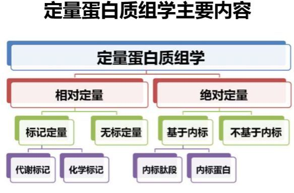
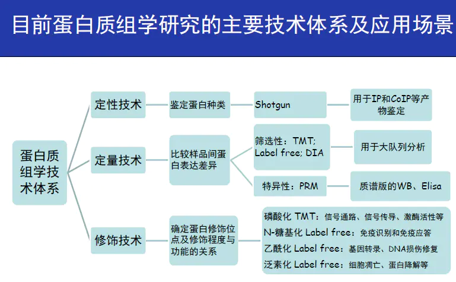


### 1.4 蛋白质组学的两大策略

*   参考文献：Protein Analysis by Shotgun/Bottom-up Proteomics（dx.doi.org/10.1021/cr3003533| Chem. Rev. 2013, 113, 2343−2394）

*   Bottom-up，也可称为质谱shotgun分析，是目前主流策略。将蛋白从样本中提取出---蛋白被胰酶酶切，形成酶切肽---质谱鉴定酶切肽---由鉴定所得的酶切肽得到蛋白ID

*   Top-down。直接对完整的蛋白，包括翻译后修饰蛋白以及其它一些大片段蛋白测序。提取蛋白---分离蛋白，排除样本复杂性---质谱分析蛋白片段---得到蛋白ID

## 2 蛋白质组学的定量技术

### 2.1 LC-MS/MS质谱测序原理

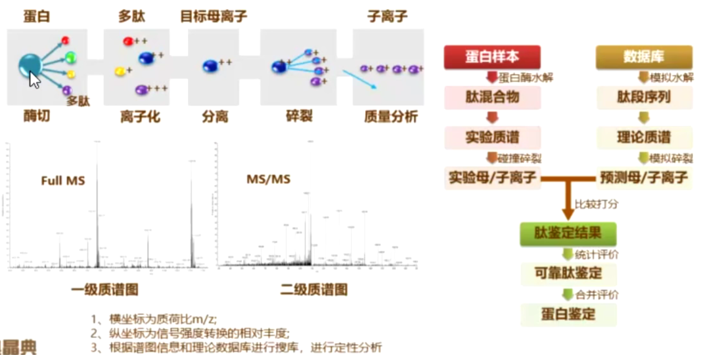

1.  酶切。蛋白的分子量比较大，难以检测。需要酶切成不同的肽段。
2.  离子化。肽段在分离之前，要进行离子化，形成一种带电的离子状态，即母离子。
3.  分离。分离出母离子，进入一级质谱仪，形成不同的质荷比丰度图。根据3维信息，横坐标是m/z值，纵坐标是离子强度，再加上LC测的保留时间，可鉴定和定量特定的肽段。
4.  二级谱图。给母离子自由能，进行碎裂。形成很多碎片离子，即子离子。然后形成二级质谱图用于进一步确定母离子的结构和组成。
5.  肽段鉴定。与数据库理论谱图库进行比较，将实验得到的母离子和子离子与数据库中进行比较，进行鉴定。


### 2.2 质谱测序流程

1.  样品准备：收集待分析的化合物或混合物，并准备成适当的样品形式。这可能涉及到提取、纯化、浓缩和溶解等步骤。这一步比较重要的信息是用什么酶进行酶解，要不要加标记，要不要富集修饰蛋白。同一酶解方法所获得的肽段是类似的，不同酶解获得的肽段不一样，因此后期要选择相应酶解制作的理论谱库。
2.  预处理样品：通过气相色谱质谱（GC-MS）或液相色谱质谱（LC-MS）等技术实现，由于蛋白质的吸附能力不同，因此在LC中的保留时间是不一样的。主要是为了分离、富集、净化蛋白质样本。
    - 分离蛋白质混合物：LC用于将复杂的蛋白质混合物分离成更简单、更纯净的肽段。
    - 富集目标蛋白质：LC可以用于从复杂样本中富集特定的目标蛋白质，这对于检测低丰度蛋白质或生物标志物非常有用。
    - 去除杂质：LC可以帮助去除样本中的杂质，如盐类、小分子化合物和其他干扰物质，以净化样本，以便进行后续分析。
    - 分离修饰的蛋白质：LC可用于分离蛋白质修饰体系，如糖基化、磷酸化、甲基化等。这有助于进一步的修饰分析。
3.  离子化：在质谱仪内部，样品分子通常需要被离子化，以生成带电离子。这可以通过不同的方法实现，包括电子冲击离子化、化学离子化、电喷雾离子化等。
4.  一级质谱图：离子化后，带电离子被传送到质谱分析部分。这通常涉及一个质量分析器，如飞行时间质谱仪（TOF-MS）、四极杆质谱仪或离子阱质谱仪等。
    - 质谱分析器将带电离子按照它们的质荷比（mass-to-charge ratio，m/z）进行分离和分析。这导致生成一系列离子信号。
    - 根据分析结果，生成一级质谱图，其中包含带电离子的质荷比（m/z）和离子强度的信息。
    - 质谱图上的多个m/z峰通常代表不同肽段。一级质谱鉴定的方式主要指胎指纹图谱(peptide-mass mapping, PMF)，即利用质谱仪精确测量酶解片段的分子量并搜库比较实现蛋白质的鉴定。
5.  碎裂和生成二级质谱图：样品中的离子可以被进一步碎裂，形成碎片离子。这通常通过碰撞池（collision cell）或其他装置来实现。
    - 二级质谱是在一级质谱的基础上再选择部分肽段做进一步的破碎并对碎片进行深入分析和比较，鉴定出该肽段的序列并结合PMF的结果从而实现蛋白质的鉴定。
    - 二级质谱能够得到部分肽短的序列，具有更高的可靠性。
7.  数据分析：使用质谱数据分析软件，对一级和二级质谱图进行解释和处理。这包括鉴定分子、确定其结构、计算分子量和解析化学反应机理等。
8.  结果报告：根据数据分析，生成实验结果的报告，包括化合物的结构信息、相对丰度、质量数据和可能的鉴定。


### 2.3 Label-free定量

顾名思义，就是不使用任何标记方法，无需昂贵的同位素标签做内标，直接对肽段进行质谱鉴定和定性定量分析。实验流程简单，只需要对蛋白进行常规酶解和除盐步骤即可上机。定量方式分为两种：峰面积（Peak intensity）和峰计数（Spectral count），常用的是峰面积。不过，由于质谱采集时只选取topN的母离子进行二级碎裂和MS2检测，所以会丢失一些丰度较低的肽段信息，缺失值比较多。

其基本原理是基于肽段母离子提取峰面积（XIC），先鉴定样品中的肽段及蛋白质，再对鉴定到的肽段（蛋白）进行定量分析，不仅提高了样品定量的速度，也提高了结果的准确度。

方法一：基于离子流色谱峰(extracted ion current, XIC)的定量算法（MaxQuant）
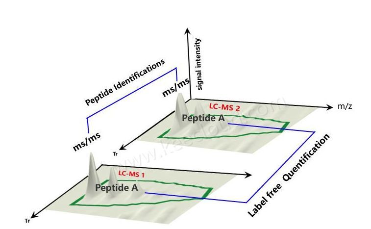

在保留时间(retention time, RT)轴上, 根据肽段母离子的质荷比提取不同保留时间下的相应同位素峰 簇的信号强度, 重构 XIC, 并利用 XIC 的面积或信号 加和等指标作为肽段的定量结果.

方法二：谱图计数（Spectral Counting）方法。一个蛋白对应的二级谱图数目越多，丰度越高
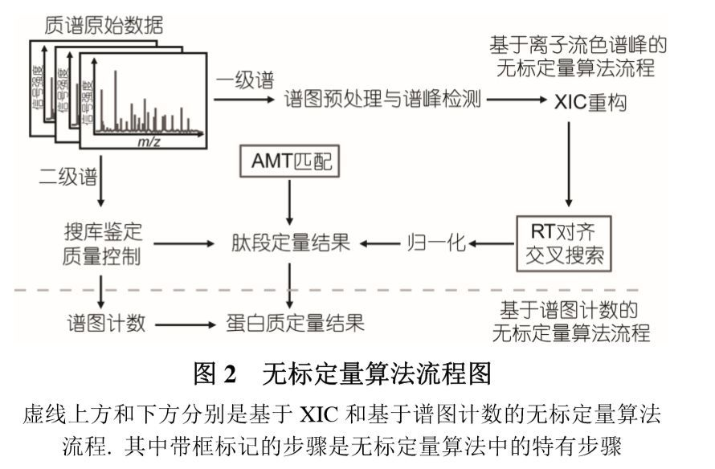

### 2.4 iTRAQ/TMT定量

#### 技术原理

iTRAQ和TMT是分别由美国AB Sciex公司和Thermo公司研发的多肽体外标记定量技术, 采用8种或10种同位素标签,通过特异性标记多肽的氨基酸基团, 一次上机可实现8种或10种不同样本中蛋白质的相对定量,是近年来定量蛋白质组学常用的高通量筛选技术。

技术原理： iTRAQ和TMT原理类似,以iTRAQ试剂为例,该试剂结构由报告基团、中性平衡基团和反应基团三部分组成。不同报告基团及其相对应平衡基团的质量和都相同,而反应基团能与赖氨酸ε氨基和所有肽链的氨基末端连接,可标记所有氨基酸。不同标记试剂与来源于不同样品胰酶消化后的肽段结合,经过色谱分离,并通过一级质谱和二级质谱。平衡基团在二级质谱时发生中性丢失,而报告基团在二级质谱低质量区域产生多个报告离子,其信号强度分别代表该标记样品的表达量,根据报告离子的峰面积计算同一蛋白质同一肽段在不同样品间的比值,从而实现蛋白的相对定量。
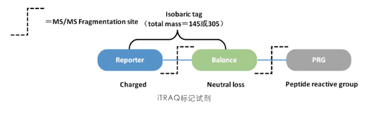

iTRAQ实际上是一种同位素标记试剂，可与氨基连接的胺标记同重元素。目前有两种主要使用的iTRAQ试剂：4-plex和8-plex，可同时标记4组或8组样品。下面以4-plex为例来说明iTRAQ试剂标记原理。
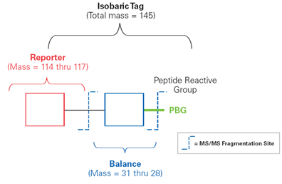

1.  iTRAQ包括三部分：报告基团（reporter group ），平衡基团（balance group），肽反应基团（peptide reactive group）。
2.  肽反应基团（peptide reactive group）：将reporter group与肽N端及赖氨酸侧链连接，从而将报告基团和平衡基团标记到肽段上，几乎可以标记样本中所有蛋白质。
3.  报告基团（reporter group）：质量分别为114Da、115Da、116Da、117Da。在二级质谱中与其它基团分离，以产生不同波峰，与其它样本进行区分。
4.  平衡基团（balance group）：质量分别为31Da、30Da、29Da、28Da，使得四种iTRAQ试剂报告基团和平衡分子的总分子量均为145Da，无论使用哪种iTRAQ试剂，不同同位素标记同一肽段后在一级质谱中，分子量完全相同，呈现的都是同一峰值。
5.  而8-plex的报告基团共有八种，质量分数分别为114-121Da（图2b），因此iTRAQ最多可同时标记8组样品。
    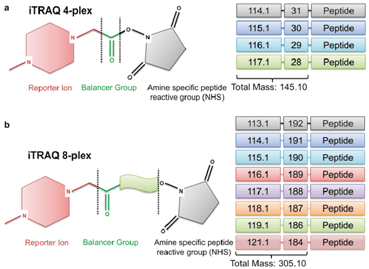

#### 工作流程

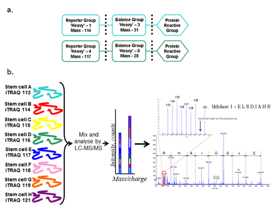

1.  分别水解蛋白样品，得到肽段的混合物。
2.  用iTRAQ对蛋白样品进行标记，使不同iTRAQ试剂标记样品中的所有肽，并混合所有标记后的蛋白样品（图3b）。
3.  对混合标记后的蛋白样品进行串联质谱，得到一级质谱图。在一级质谱图中，因为无论使用哪种iTRAQ试剂，不同同位素标记同一肽段后分子量完全相同，所以不同来源的同一蛋白同一标记肽段在一级质谱图中呈现为一个。
4.  收集一级质谱图中同一个峰的样品，得到不同样品的相同肽端混合物。如收集到图4黄色标记处的蛋白样品，对加入标记的肽段进行二级质谱，得到二级质谱图。此时报告基团、平衡基团和多肽反应基团之间的键断裂，平衡基团丢失，带不同同位素标记的同一多肽产生质量为113，114，115，116，117，118，119和121Da的报告离子（8-plex），报告离子呈现出不同的峰，将波峰的高度面积等相关数据经过软件处理，结合数据库对比分析，可获得不同样品间相同肽段的定量信息。

### 2.5 DIA蛋白定量

DIA数据非依赖采集（Data independent acquisition，DIA）是近年来备受瞩目的质谱采集技术之一，一度引领了定量蛋白质组学新发展。DIA技术的原理是在质谱数据采集时，高速、循环的将每个采集窗口内的所有母离子及其碎裂后的子离子进行全扫描，而非根据母离子信号强度筛选后进行二级碎片再扫描。

其实DIA也是非标记技术的一种，相比于传统label free、iTRAQ/TMT采用的数据依赖性扫描模式，一级质谱进行全扫描采集母离子信号生成一级谱图，二级质谱的最大的优势在于高效测定复杂样品中相对低丰度的蛋白分子，极大地提高了定量分析的可信度。

2011年DIA就开发出来，但是实际大规模应用还是2018年开发出4D技术。这是因为原来DIA的数据利用率比较低，只有20，现在的技术可以达到90% 。

### 2.6 不同测序技术的区别

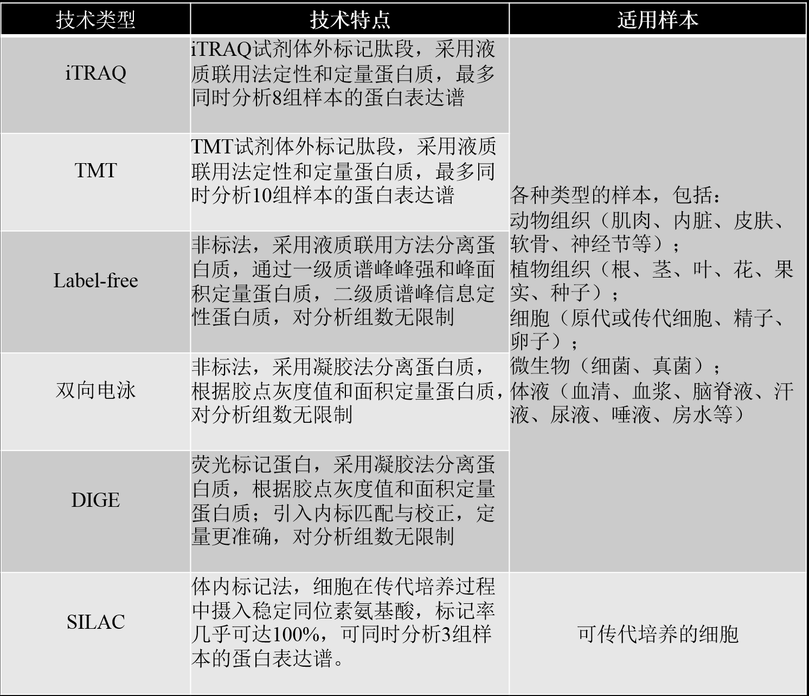

#### 1. iTRAQ和TMT的结构与区别

iTRAQ和TMT是近年来应用最广泛的差异蛋白质组学技术，它们均采用体外标记的方法，利用同位素试剂标记蛋白质酶解后产生的多肽，对两个或多个样本，在全蛋白质组层面上展开相对定量分析。
说到这里,很多人可能会认为iTRAQ和TMT是两种不同的定量技术，其实二者只是不同厂家生产的（iTRAQ是AB SCIEX研发，TMT是Thermo Fisher研发），在标记规格（iTRAQ是4标和8标的；TMT是2标、6标以及10标的）、标签分子结构上有些许差异，其他原理基本一样。

#### 2. 液相色谱-质谱（LC-MS）和液相色谱-质谱/质谱（LC-MS/MS）区别

LC-MS（液相色谱-质谱）：
- LC-MS是一种联用技术，将液相色谱和质谱结合在一起，用于分析和鉴定化合物，如药物、代谢产物、蛋白质等。
- 在LC-MS中，样品通常首先通过液相色谱分离，以分离和纯化复杂的混合物。然后，分离的化合物进入质谱仪，进行质谱分析，以确定其质谱特性，如质荷比（m/z）和丰度。

LC-MS/MS（液相色谱-质谱/质谱）：
- LC-MS/MS是LC-MS的进化版本，它包括两个质谱阶段，通常称为“串联质谱”（tandem mass spectrometry）。
- 在LC-MS/MS中，分离后的化合物首先经过质谱仪的第一个阶段（MS1）分析，以确定其质荷比。然后，特定的离子或分子离子被选择并进一步分析，通过第二个质谱阶段（MS2）进行碎片质谱分析。
- MS2阶段的分析通常用于更详细地研究分子的结构和组成，以便确定其身份、结构和修饰。

总结：主要区别在于LC-MS只包括单一的质谱阶段（MS1），而LC-MS/MS包括两个质谱阶段（MS1和MS2）。LC-MS/MS具有更高的分辨能力和鉴定能力，因为它能够提供更多关于化合物的信息，特别是对于复杂的混合物或未知物质。这使LC-MS/MS成为生物分析、蛋白质质谱学和代谢组学等领域中的强大工具。

### 相关问题

*   iTRAQ/TMT与Label free相比有什么优势？

Label free无需同位素标记，不受样本条件的限制，定性没有问题，但是定量的准确性不高，会受到质谱重复性等因素的影响。
iTRAQ/TMT的覆盖度高、灵敏度高、重复性好。但是在混标上机时要充分考虑样品的情况，样品数量较多时，实验设计会较为复杂。

*   做iTRAQ/TMT蛋白质组学分析，不同老师的样本可否放在一组上机？

不同老师的样品或者同一个老师不同实验的样品，都不能放在一组上机。不同的物种的样品，在搜库的时候选择的数据库不一样，无法进行搜库比较。同一个物种的不同处理的样品，经过不同实验室处理后，样品里的蛋白种类和丰度会有较大差别，混在一起后会影响两组不同来源的样品的蛋白鉴定。

*   蛋白质组学相关的文章中，选择的差异倍数经常有1.2倍、1.3倍、1.5倍、2倍等待的，这有没有一个统一的标准？

目前蛋白组学分析大多数是按照差异倍数2倍或1.5倍进行分析的，但是我们要根据实际情况，对差异倍数做出合适的调整，这样才能得到最佳的结果。在文章发表当中，没有谁规定差异倍数必须是多少。我们做分析的时候要学会灵活处理，不要墨守成规！

*   iTRAQ/TMT定量蛋白质组做完实验后，能拿到什么结果呢？

可以拿到差异蛋白、差异蛋白的GO、KEGG、COG等数据库的注释信息和富集信息、差异蛋白的聚类分析、差异蛋白的互作分析等结果。如果有其他实验数据，比如转录组测序结果，那么可以做转录组和蛋白质组学的联合分析，找出差异蛋白和差异基因的相互作用关系等。

*   所研究的物种没有全基因组序列，能否做蛋白质组学分析呢？

没有参考基因组的物种也可以做蛋白质组学分析，一般我们会先看其近缘物种有没有参考基因组，如果有的话，可以考虑使用。或者我们对所测样品做一个转录组测序，使用转录组构建一个简易的蛋白库作为数据库使用。如果二者都没有的话，那就不建议做了，结果会非常不准确的。

*   在做转录组和蛋白质组联合分析时，为什么有些差异表达基因在蛋白层面没有相应的差异蛋白？

由于转录和翻译是两个不同的生物学过程，引起基因差异表达和蛋白差异的原因有很多，比如非编码RNA的调控、蛋白的降解、蛋白的分泌等等。所以差异基因和差异蛋白不可能完全一致，根据经验，其相关性也就50%不到。

*   蛋白质组学分析也要求重复么？生物学重复or技术重复？几次重复？

生物重复是必须的，一般来说至少3次生物学重复。技术重复可以不做，当然做了更好，会增加实验的严谨性。

*   如果样品数量较多，不同批次之间的误差怎么进行校正？

由于itraq或tmt技术上的限制，最多标记10个样品，所以，当样品数超过10个的时候就需要设置内参，以矫正不同批次之间的批次差异。
比如：做18个样品，则需要做成两组10标的进行上机，每组9个样品加1个内参（内参是多个样品的混样或标准品），总共需要做的样品数就是9+9+1+1=20个。

*   原核生物比如细菌能够做蛋白质组学分析么？

iTRAQ/TMT适合任意来源的总蛋白样本，植物、动物、细菌、真菌等。在分析上原核和真核生物没有明显的区别。


## 3. 蛋白质组学的分析流程

### 1. 测序

将蛋白质样品进行酶解，产生肽段。然后，通过质谱仪将肽段进行分离和检测，得到质谱图谱即质荷比+强度数据。通常是通过公司测序得到质谱的raw格式文件。

### 2. 鉴定及定量蛋白质

这步主要目的是将raw文件中的肽段进行搜索，即通过比对实验数据与已知蛋白质数据库进行匹配，确定样品中存在的蛋白质。有两种方式鉴定蛋白，一种是基于数据库进行搜索，一种是从头组装。

同时进行蛋白质定量，即测定样品中不同蛋白质的相对或绝对丰度的过程。

常使用MaxQuant等搜库和定量，获得初始结果（肽段、蛋白信息）

### 3. 数据分析

数据分析是蛋白组学测序流程的最后一步，旨在解读和解析蛋白质组学数据。通过生物信息学工具和统计分析方法，对蛋白质鉴定和定量结果进行数据挖掘和功能注释。

推荐使用R进行数据分析。

#### 3.1 质控

*   去除污染蛋白。
*   去除unique 肽段（特有肽段）小于等于1的蛋白
*   去除缺失值太多的蛋白

#### 3.2 规一化及填充

*   不进行规一化
*   使用MSnbase包中的MinProb算法进行缺失值填充。

#### 3.3 差异表达

<https://www.biorxiv.org/content/biorxiv/early/2023/06/29/2023.06.26.546625.full.pdf>
<https://www.bioinfo-scrounger.com/archives/541/>
<https://zhuanlan.zhihu.com/p/448479536>

推荐limma包进行差异分析，要更稳健。

```


```

##### 3.4 富集分析

使用clusterProfiler进行富集分析

## 4. MaxQuant介绍

The MaxQuant computational platform for mass spectrometry–based shotgun proteomics  （值得细细的阅读）

MaxQuant是基于质谱(Ms)的蛋白质组学数据分析最常用的平台之一，目前认可度相对较高，可针对多种质谱数据。拥有自己的肽段搜索引擎- Andromeda。对于碰撞诱导离解(CID)、高能碰撞离解(HCD)和电子转移离解(ETD)所产生的串联光谱可以很容易地用MaxQuant进行分析。针对每种方法，采用自定义的多级评分方案，对每种特定的碎片化技术的多肽鉴定进行优化。MaxQuant使用target-decoy搜索策略以估计和控制假阳性。
一般用来进行鉴定和定量分析。

### 原理

Controlling FDRs 控制假阳性: 从复杂的自底向上的蛋白质组学实验中得到可靠的蛋白质鉴定需要严格的统计分析和对错误鉴定的严格控制。

关键点：target-decoy 反向数据库

方法：

*   采用相同的条件检索反相数据库，或者将两个数据库合并检索，用来模拟随机匹配的过程。FDR=decoy/target 调整阈值，使FDR在1%以内。
*   将原数据库（target database）中的所有蛋白序列逐条反转，或随机打乱顺序, 得到 反相数据库 (decoy database)
*   反相数据库 (decoy database) 中的蛋白数目，长度，酶切后获得的多肽的数目，氨基酸组成均与原数据库相同。
*   与原始数据库不同的是，这些多肽序列是虚构的，不可能在样品中存在
*   判断
    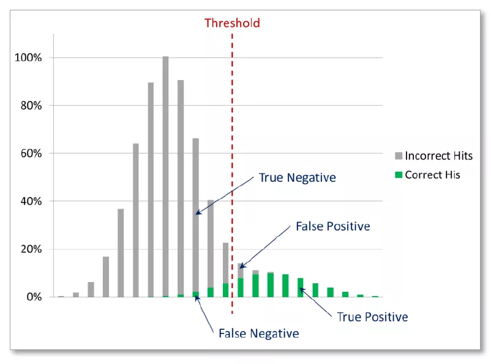

## 5. Perseus介绍

作为MaxQuant的后续分析工具，[Perseus](https://www.maxquant.org/perseus/)具有丰富的可视化功能与统计分析功能:

*   聚类分析
*   差异蛋白筛选
*   时序数据分析
*   网络分析

但使用R包会更灵活和流程化，因此可替代Perseus软件。
