

[Single-cell RNA sequencing shows the immunosuppressive landscape and tumor heterogeneity of HBV-associated hepatocellular carcinoma](https://www.ncbi.nlm.nih.gov/pmc/articles/PMC8211687/)是2021年6月刚发表在NC上的文章，主要是利用单细胞转录组分析HCC患者的肿瘤异质性和免疫相关内容。本文主要复现这篇文章的生物信息分析方面的结果，包括上游的比对和定量，下游的异质性和细胞互作等内容。

## The upstream analyses of Single cell RNA-seq data

### Data collection

The sequence data for 8 liver carcinoma was deposited in NCBI with
accession code of
[SRP318499](https://www.ncbi.nlm.nih.gov/sra/?term=SRP318499).  
We download the bam files of 8 samples using ascp software. The size of
8 samples was listed below:

    du -sh rawData/*bam
    ## 56G  rawData/095_possorted_genome_bam.bam
    ## 23G  rawData/104_possorted_genome_bam.bam
    ## 22G  rawData/106_possorted_genome_bam.bam
    ## 51G  rawData/114_possorted_genome_bam.bam
    ## 45G  rawData/119_possorted_genome_bam.bam
    ## 22G  rawData/713_possorted_genome_bam.bam
    ## 27G  rawData/725_possorted_genome_bam.bam
    ## 53G  rawData/740_possorted_genome_bam.bam

### Gene expression quantification

We then convert bam files to fastq format, count gene expression for
each samples, and aggregate 8 count matrices to one matrix. Take sample
with 119 id for example:

    # 1. the barcoded BAM files are covered to FASTQ files with the 10x Genomics bamtofastq tool
    bamtofastq --nthreads=8 119_possorted_genome_bam.bam 119 
    
    # 2. perform read alignment, UMI counting,
    cd 119
    cellranger count --id=119 --transcriptome=/media/zhangfeng/myData/reference/refdata-gex-GRCh38-2020-A --fastqs=trial5d_count_new_0_1_HG3WLDMXX --chemistry=SC3Pv2 # note: the default parameter of chemistry would throw error, the SC3Pv2 should be defined
    
    # 3. use the cellranger aggr pipeline to aggregate outputs from multiple runs of cellranger count, normalize runs to the same effective sequencing depth
    cellranger aggr --id=aggr --csv=libraries.csv

We can review the summary from the
[web\_summary.html](web_summary.html).  
The `aggr` analysis detected a error : Low Post-Normalization Read Depth
of 19.8% , which means that there may be large differences in sequencing
depth across the input libraries.  
So we have to quality control for each samples and then combine them
together.

### Quality control

Firstly, I check the quality of features, counts, and the percentage of
mitochondrial genes

    library(Seurat)
    load("cluster/2_qc/rawSeurats.RData")
    dim(rawSeurats);
    
    ## [1] 26428 41630
    
    table(rawSeurats@active.ident)
    
    ## 
    ##   095   104   106   114   119   713   725   740 
    ##  8388   540   757 11855  7535  1368  2464  8723
    
    VlnPlot(rawSeurats,features = c("nFeature_RNA"))

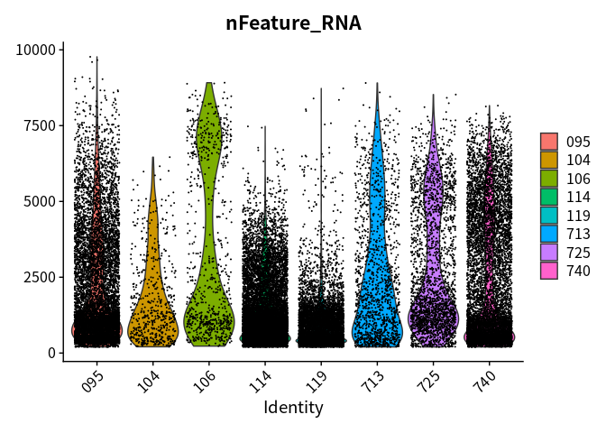

    VlnPlot(rawSeurats,features = c("nCount_RNA"))

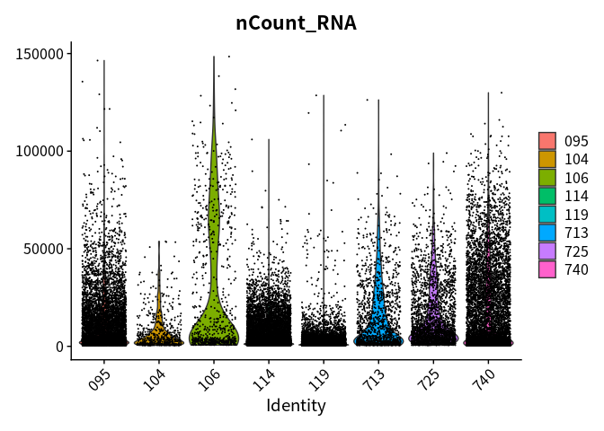

    VlnPlot(rawSeurats,features = c("percent.mt"))

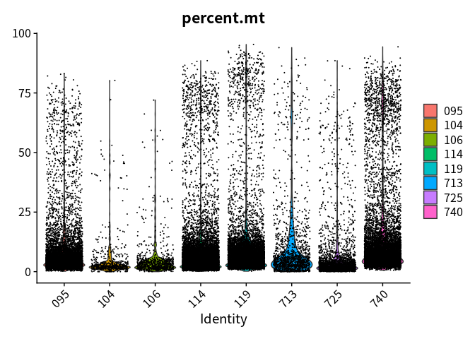

I perform the qulity control analysis as proposed by [Current best
practices in single‐cell RNA‐seq analysis: a
tutorial](https://www.ncbi.nlm.nih.gov/pmc/articles/PMC6582955/), which
was published by Luecken at 2019. The distributions of these QC
covariates are examined for outlier peaks that are filtered out by
thresholding.  
After quality control, the features, counts, and the percentage of
mitochondrial genes are checked again:

    load("cluster/2_qc/cleanSeurats.RData")
    dim(cleanSeurats);
    
    ## [1] 26428 17371
    
    table(cleanSeurats@active.ident)
    
    ## 
    ##  095  104  106  114  119  713  725  740 
    ## 3719  406  435 5721 3030  894 1439 1727
    
    VlnPlot(cleanSeurats,features = c("nFeature_RNA"))

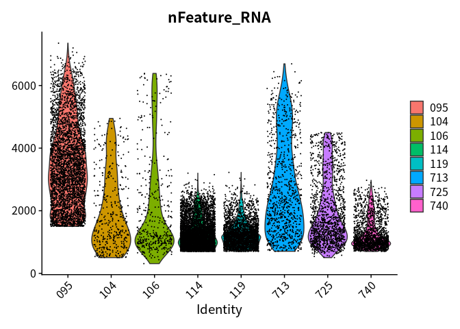

    VlnPlot(cleanSeurats,features = c("nCount_RNA"))

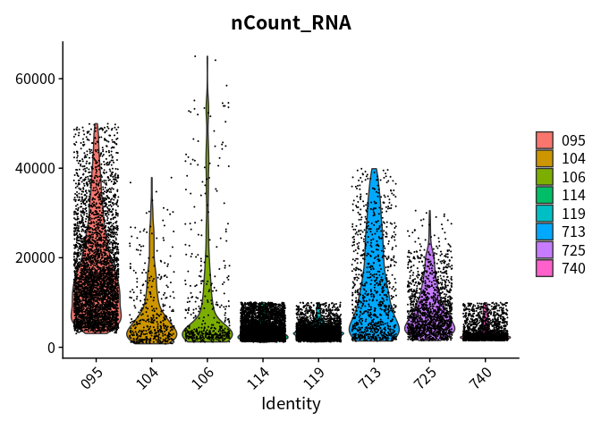

    VlnPlot(cleanSeurats,features = c("percent.mt"))

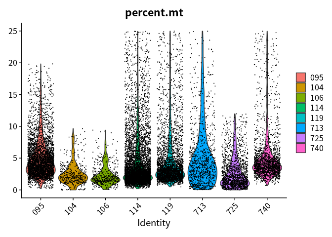

The plots show that the outlier value are deleted.

### Cluster and annotation

The Seurat package then is used to preform PCA, reduction, cluster, UMAP
and TSNE analysis

#### 1. PCA

I conduct the PCA analysis for all cells :

    load("cluster/3_cluster/cleanSeurats_standard.RData")
    DimPlot(object = cleanSeurats, reduction = "pca",label =T)

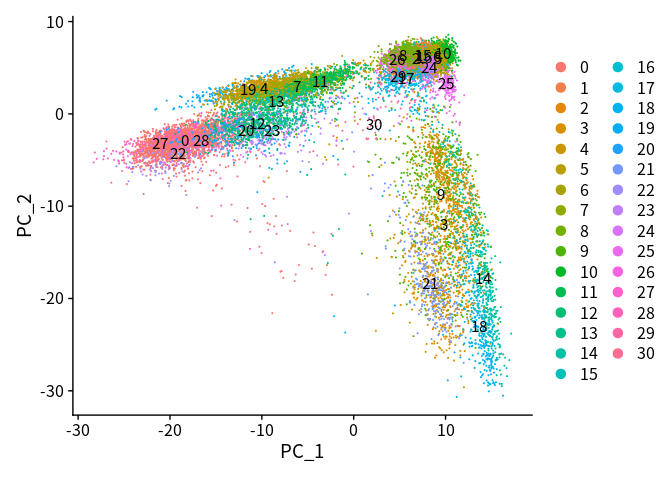

    DimPlot(object = cleanSeurats, reduction = "pca",label =T,group.by = "orig.ident")

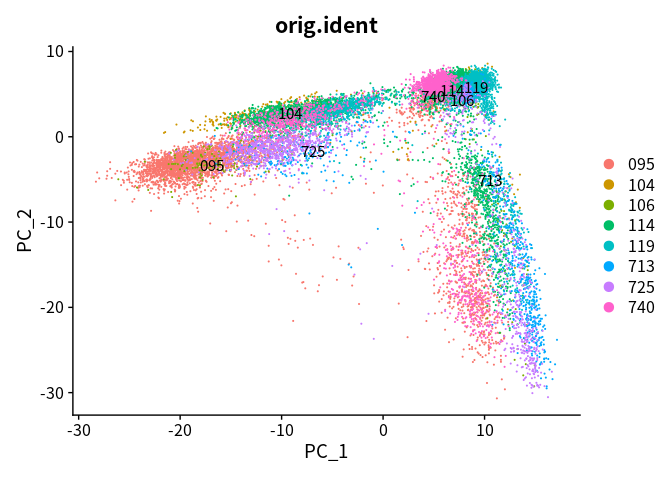

The PCA plots show that maybe batch effect exist. The CCA method is used
to adjust batch effect. I then perform the CCA analysis to adjust the
batch effect:

    load("cluster/3_cluster/cleanSeurats_adjusted.RData")
    DimPlot(object = cleanAdjustSeurats, reduction = "tsne",label =T,group.by = "orig.ident")

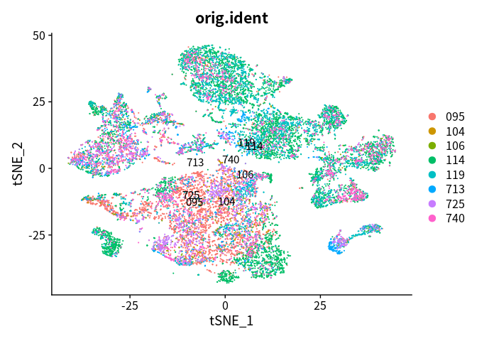

    DimPlot(object = cleanAdjustSeurats, reduction = "umap",label =T,group.by = "orig.ident")

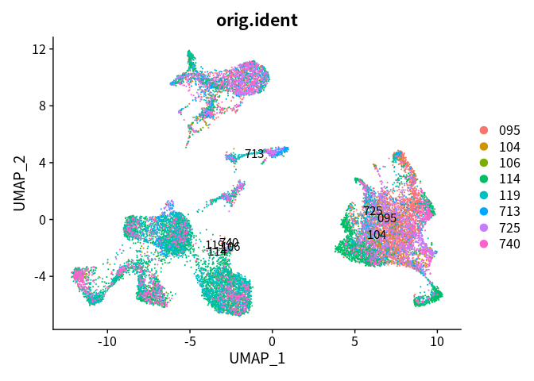

Due to the heterogeneity patients with liver cancer, the tumor cell
across cancer samples should be independent each other. However, these
cells are mixed. I think that the batch effect is over-estimated.  
Finally, I decide to run standard workflow as Seurat proposed. The step
of batch effect adjustion analysis is skipped.

#### 2. Reduction and TSNE analysis

The UMAP and TSNE plot are drew below:

    load("cluster/3_cluster/cleanSeurats_standard.RData")
    DimPlot(object = cleanSeurats, reduction = "tsne",label =T)

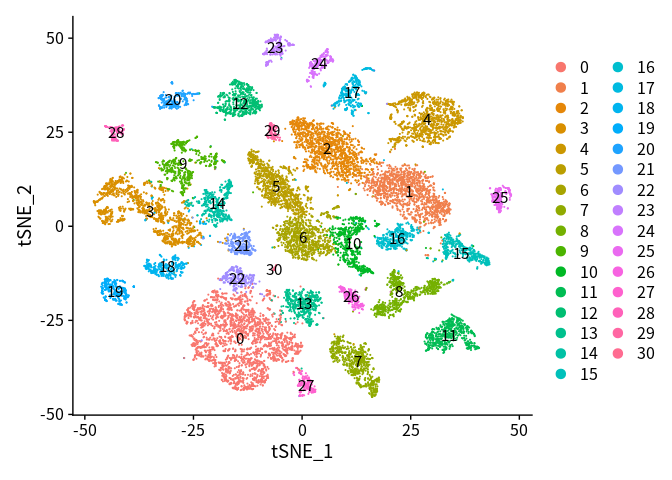

    DimPlot(object = cleanSeurats, reduction = "tsne",label =T,group.by = "orig.ident")

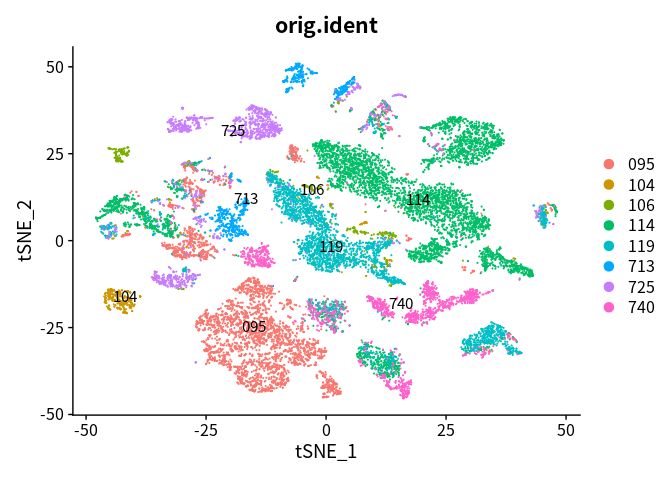

The patients with tumor cell are split, which is coincident with our
common sense.  
However, in comparision with TSNE, the UMAP is better, which can clearly
show the difference between case identify, and infiltrating immnue
cells.

#### 3. UMAP analysis

    DimPlot(object = cleanSeurats, reduction = "umap",label =T)

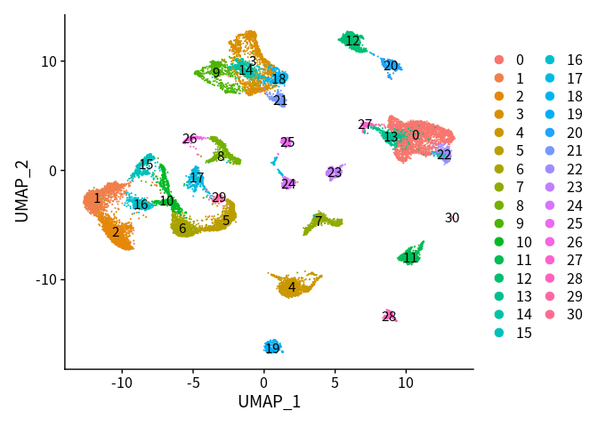

    DimPlot(object = cleanSeurats, reduction = "umap",label =T,group.by = "orig.ident")

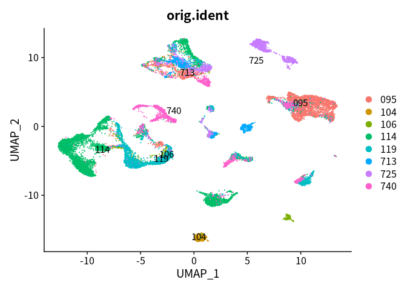

Taken together, we used UMAP to show the cluster of different cell
types. The SingleR and markers are combined to define different cell
types.

    load("cluster/3_cluster/cleanSeurats_anno.RData")
    DimPlot(object = cleanSeurats, reduction = "umap",label =T,group.by = "celltype_fine")

## The downstream analyses of Single cell RNA-seq data

### Cell type heterogeneity

We find that the cells from the same case are tended to cluster
together:

    DimPlot(object = cleanSeurats, reduction = "umap",label =T,group.by = "celltype_fine")

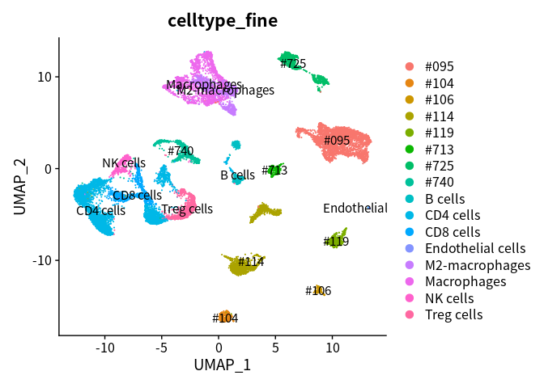

However, different HCC case have different proportion of immune cells.
The proportion of different cells in 8 HCC cases are calculated :

    library(data.table)
    library(ggplot2)
    library(ggpubr)
    library(stringr)
    load("cluster/3_cluster/cleanSeurats_anno.RData")
    
    ############### T cells and macrophages
    # cell proportion in cases
    anno = cleanSeurats@meta.data %>% setDT()
    cellPro = anno[,.(totalNum=.N,
                      Non_M2=sum(celltype_fine=="Macrophages")/.N,
                      M2=sum(celltype_fine=="M2-macrophages")/.N,
                      CD8=sum(celltype_fine=="CD8 cells")/.N,
                      CD4=sum(celltype_fine=="CD4 cells")/.N,
                      B_cells=sum(celltype_fine=="B cells")/.N,
                      NK=sum(celltype_fine=="NK cells")/.N,
                      Tumor=sum(str_detect(celltype_fine,"^#"))/.N,
                      Other=sum(celltype_fine%in%c("Endothelial cells","Treg cells"))/.N),by="orig.ident"]
    rowSums(cellPro[,-c(1:2)]) # equal to 1
    
    ## [1] 1 1 1 1 1 1 1 1
    
    y=as.matrix(t(cellPro[,-c(1:2)]))
    barplot(y,xlim=c(0, ncol(y) + 4),
            col=c("red","black","blue","yellow","gray","green","white","purple"),
            names.arg=cellPro$orig.ident,
            legend.text=TRUE,
            args.legend=list(
              x=ncol(y) + 4,
              y=max(colSums(y)),
              bty ="n"
            ))

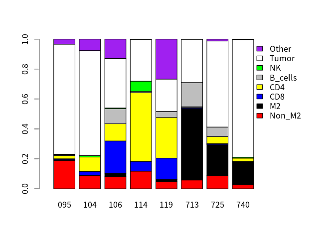

### T cells and macrophages

The correlation between proportion of T cells and macrophages in cases are calculated:

    # correlation
    ggplot(cellPro, aes(x = M2, y = CD8)) + 
      geom_point() +
      stat_smooth(method = "lm", col = "blue")+
      stat_cor(label.x = 0, label.y = -0.2) +
      labs(title="scRNA-seq cohort", x="M2 macrophages proportion", y="CD8T proportion")+
      theme(plot.title = element_text(hjust = 0.5))

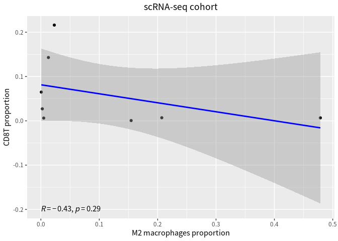

To compared with bulk RNA-seq , the immune cell deconvolution analysis is performed, and the correaltion relationship is represent by linear model :

    # tcga immune cell
    lihc = read.csv("cluster/6_prognosis/TCGA_LIHC_TME_results.csv",head=T)
    ggplot(lihc, aes(x = Macrophages.M2, y = T.cells.CD8)) + 
      geom_point() +
      stat_smooth(method = "lm", col = "blue")+
      stat_cor(label.x = 0.4, label.y = 0.4)+
      labs(title="TCGA LIHC cohort", x="M2 macrophages proportion", y="CD8T proportion")+
      theme(plot.title = element_text(hjust = 0.5))

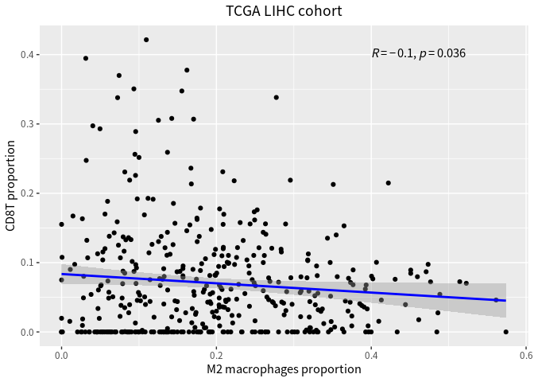

We also detect inverse correlation between the proportions of infiltrating T cells and macrophages.

### Immunosuppressive marker expression of TAMs

We examined the expression of reported immunosuppressive genes in TAMs:

    load("cluster/3_cluster/cleanSeurats_anno.RData")
    FeaturePlot(cleanSeurats, features = c("LAIR1","HAVCR2","LGALS9","VSIR"))

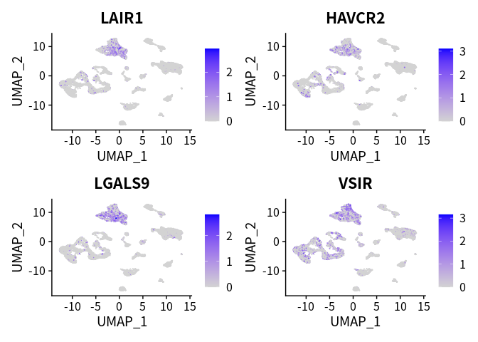

    DimPlot(object = cleanSeurats, label =T,group.by = "celltype_fine")

These markers are enriched in TAM cells.  
In addition, the pattern of CD163 (M2 macrophages marker) expression and LAIR1 is similar:

    cellKeep = colnames(cleanSeurats)[cleanSeurats@meta.data$celltype_main=="Macrophages"]
    VlnPlot(subset(cleanSeurats,cells=cellKeep), features = c("CD163", "LAIR1", "CD68","HAVCR2","LGALS9","VSIR"))

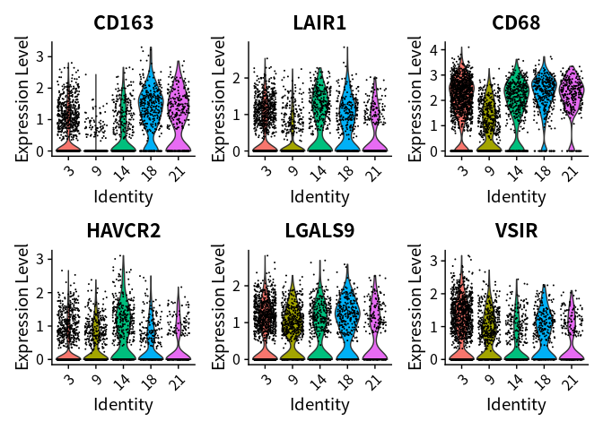

These suggest the immunosuppressive function of TAMs might be exerted via LAIR1.  
In addition, the high expression of `LAIR1` and `HAVCR2` is significantly associated with poorer overall or disease-free survival of HCC patients.

The overall survival for LAIR1 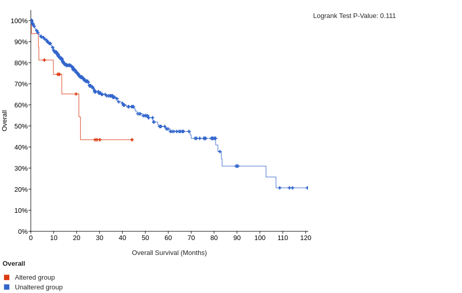,
and for HAVCR2 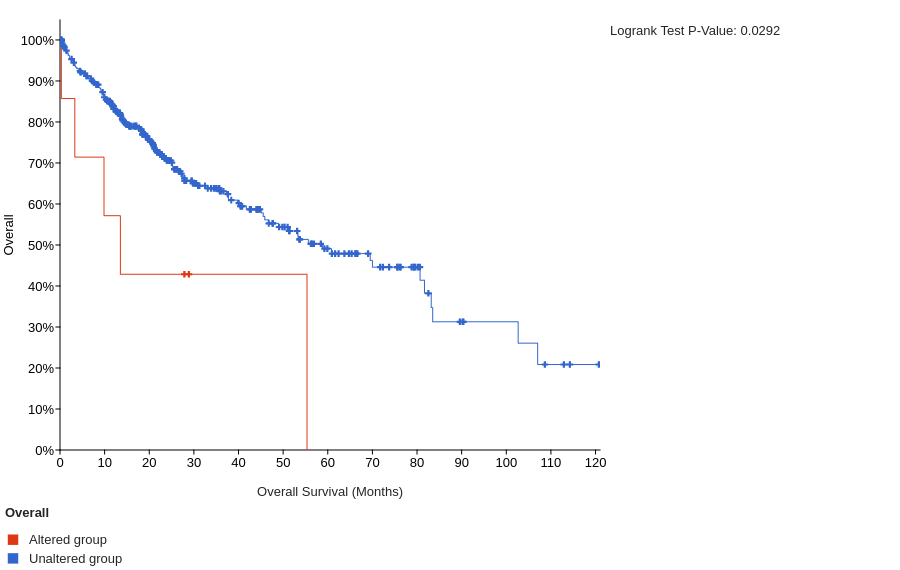.

The disease-free survival for LAIR1
, and for HAVCR2
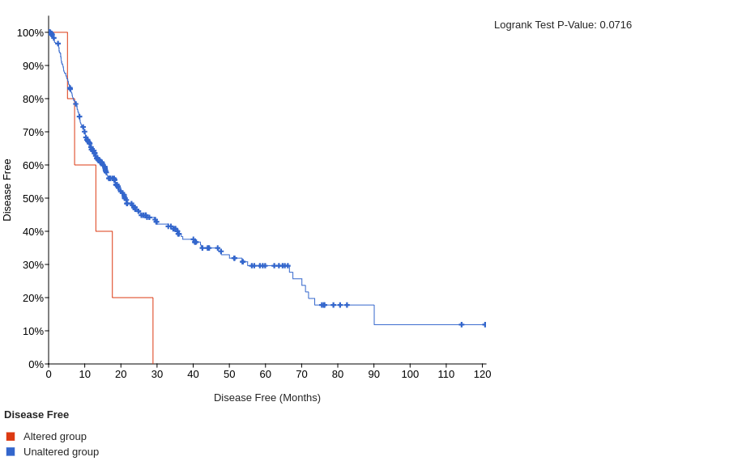.

### Cell trajectory

    library(monocle3)
    library(SeuratWrappers)
    load("cluster/3_cluster/cleanSeurats_anno.RData")
    get_earliest_principal_node <- function(cds, cluster="1"){
      cell_ids <- which(colData(cds)[, "seurat_clusters"] == cluster)
      
      closest_vertex <- cds@principal_graph_aux[["UMAP"]]$pr_graph_cell_proj_closest_vertex
      closest_vertex <- as.matrix(closest_vertex[colnames(cds), ])
      root_pr_nodes <-  igraph::V(principal_graph(cds)[["UMAP"]])$name[as.numeric(names(which.max(table(closest_vertex[cell_ids,]))))]
      
      root_pr_nodes
    }
    
    cds <- as.cell_data_set(cleanSeurats)
    cds <- estimate_size_factors(cds)
    cds@rowRanges@elementMetadata@listData[["gene_short_name"]] <- rownames(cleanSeurats[["RNA"]])

We do the single cell trajectory for CD8 population, and observed that gradual transition of CD8 T cells towards the subpopulations with exhaustion status was indicated by the upregulation of PDCD1 (PD-1) and TIGIT (T cell immunoreceptor with Ig and ITIM domains).

    cds_subset <- cds[, colData(cds)$seurat_clusters%in% c(10,16)]
    cds_subset <- cluster_cells(cds_subset)
    cds_subset <- learn_graph(cds_subset)
    cds_subset <- order_cells(cds_subset,root_pr_nodes=get_earliest_principal_node(cds_subset,cluster=10))
    # for CD8
    plot_cells(cds_subset,
               label_cell_groups=T,
               color_cells_by = "pseudotime",
               show_trajectory_graph=F)

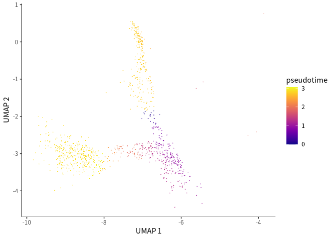

    plot_cells(cds_subset,
               label_cell_groups=T,
               genes=c("PDCD1","TIGIT"),
               show_trajectory_graph=F)

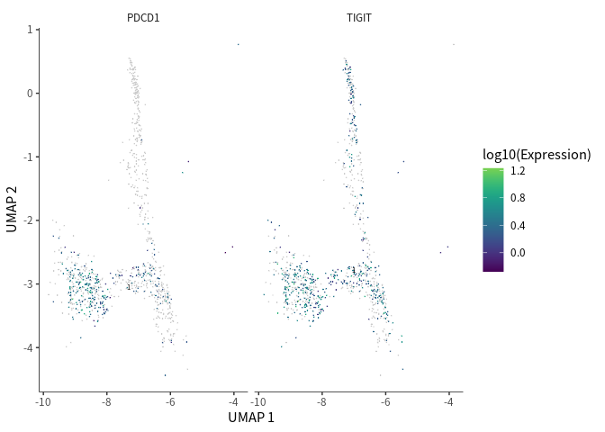

We find that exhaustion status was indicated by the downregulation of FCGR3A (activation marker) and upregulation of KLRC1 (exhaustion marker).

    # for NK cells
    cds_subset <- cds[, colData(cds)$seurat_clusters%in% c(15)]
    cds_subset <- cluster_cells(cds_subset)
    cds_subset <- learn_graph(cds_subset)
    cds_subset <- order_cells(cds_subset,root_pr_nodes=get_earliest_principal_node(cds_subset,cluster=15))
    
    plot_cells(cds_subset,
               label_cell_groups=T,
               color_cells_by = "pseudotime",
               show_trajectory_graph=F)

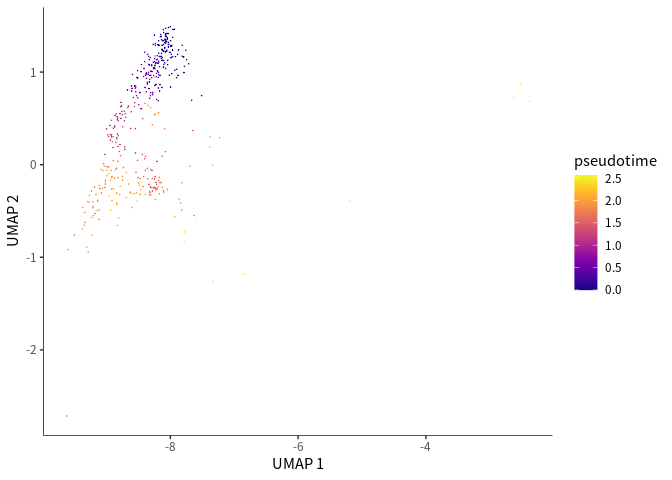

    plot_cells(cds_subset,
               label_cell_groups=T,
               genes=c("FCGR3A","KLRC1"),
               show_trajectory_graph=F)

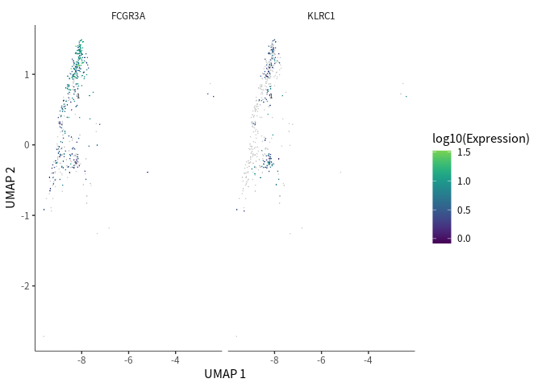

We find the transition toward a more immunosuppressive state for Treg cells, as indicated by the enriched PDCD1 expression.

    cds_subset <- cds[, colData(cds)$seurat_clusters%in% c(5,29)]
    cds_subset <- cluster_cells(cds_subset)
    cds_subset <- learn_graph(cds_subset)
    cds_subset <- order_cells(cds_subset,root_pr_nodes=get_earliest_principal_node(cds_subset,cluster=5))
    plot_cells(cds_subset,
               label_cell_groups=T,
               color_cells_by = "pseudotime",
               show_trajectory_graph=F)

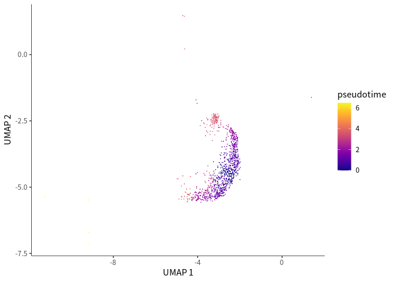

    plot_cells(cds_subset,
               label_cell_groups=T,
               genes=c("PDCD1"),
               show_trajectory_graph=F)

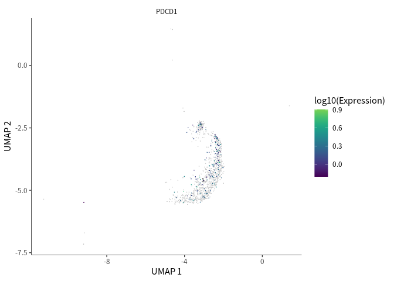

For macrophages, a dynamic transition towards more immunosuppressive M2 macrophages featured by CD163 and LAIR1 expression.

    # for TAMs
    cds_subset <- cds[, colData(cds)$seurat_clusters%in% c(3,9,14,18,21)]
    cds_subset <- cluster_cells(cds_subset)
    cds_subset <- learn_graph(cds_subset)
    cds_subset <- order_cells(cds_subset,root_pr_nodes=get_earliest_principal_node(cds_subset,cluster=9))
    
    plot_cells(cds_subset,
               label_cell_groups=T,
               color_cells_by = "pseudotime",
               show_trajectory_graph=F)

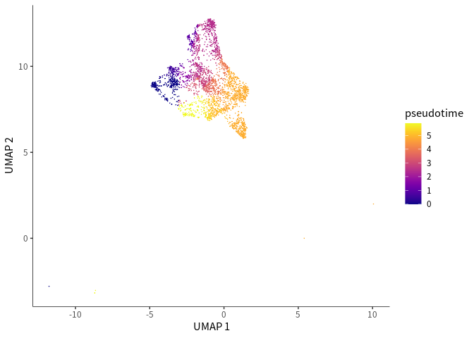

    plot_cells(cds_subset,
               label_cell_groups=T,
               genes=c("CD163","LAIR1"),
               show_trajectory_graph=F)

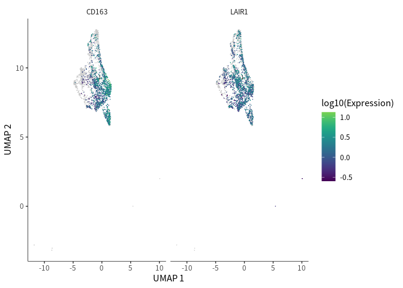

Regarding the CD4 T cells, they were mainly type 1 (Th1) and type 2T helper (Th2) cells, as indicated by their respective enrichment in the expression of STAT4 (cell cluster 11) and GATA3 (cell cluster 12).

    cds_subset <- cds[, colData(cds)$seurat_clusters%in% c(1,2,6,17)]
    cds_subset <- cluster_cells(cds_subset)
    cds_subset <- learn_graph(cds_subset)
    cds_subset <- order_cells(cds_subset,root_pr_nodes=get_earliest_principal_node(cds_subset,cluster=2))
    plot_cells(cds_subset,
               label_cell_groups=T,
               color_cells_by = "pseudotime",
               show_trajectory_graph=F)

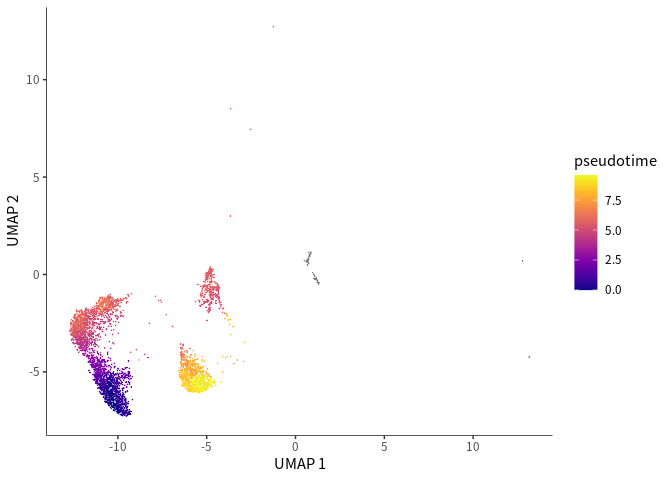

    plot_cells(cds_subset,
               label_cell_groups=T,
               genes=c("STAT4","GATA3"),
               show_trajectory_graph=F)

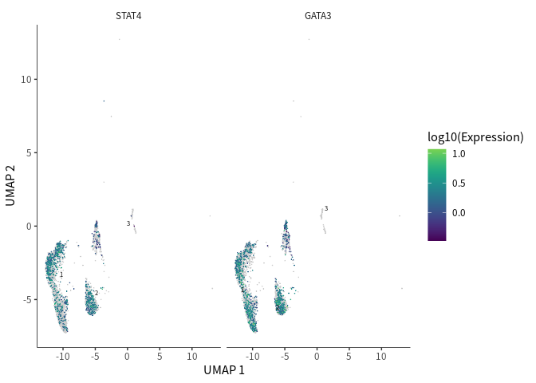

### Immune checkpoints

Immune checkpoints function as “brakes” on T cell immune responses resulting in the weakening of T cell attack and immune tolerance or escape.  
We examined the cell-cell interaction status in different cell, and the co-stimulatory and co-inhibitory checkpoints in shaping the immunosuppressive  andscape in HCC are estimated :

    mypvals <- read.delim("cluster/7_interaction/out/pvalues.txt", check.names = FALSE)
    mymeans <- read.delim("cluster/7_interaction/out/means.txt", check.names = FALSE)
    costimulatory <- grep("ICOS|ICOSLG|TNFRSF4|TNFRSF8|TNFRSF9|TNFRSF18|CD40LG|CD40|CD27|CD70|CD28|CD80|CD86|CD226|PVR|NECTIN1|NECTIN2|NECTIN3|NECTIN4|TNFSF14|TNFRSF14", 
                          mymeans$interacting_pair,value = T)
    coinhibitory <- grep("PDCD1|CD274|PDCD1LG2|HAVCR2|LGALS9|LAIR1|PTPN6|PTPN11|CTLA4|CD80|CD86|TIGIT|PVR|NECTIN1|NECTIN2|NECTIN3|NECTIN4|CD160|BTLA|TNFRSF14", 
                         mymeans$interacting_pair,value = T)
    
    # plot for co-stimulatory
    meansdf = mymeans %>% dplyr::filter(interacting_pair %in% costimulatory) %>%
      dplyr::select(c("interacting_pair","CD4 cells|Tumor","CD8 cells|Tumor","Treg cells|Tumor","NK cells|Tumor",
                      "CD4 cells|Macrophages","CD8 cells|Macrophages","Treg cells|Macrophages","NK cells|Macrophages"))  %>%  
      reshape2::melt() 
    colnames(meansdf)<- c("interacting_pair","CC","means")
    meansdf$joinlab <- paste0(meansdf$interacting_pair,"_",meansdf$CC)
    
    pvalsdf = mypvals %>% dplyr::filter(interacting_pair %in% costimulatory)%>%
      dplyr::select(c("interacting_pair","CD4 cells|Tumor","CD8 cells|Tumor","Treg cells|Tumor","NK cells|Tumor",
                      "CD4 cells|Macrophages","CD8 cells|Macrophages","Treg cells|Macrophages","NK cells|Macrophages"))%>%  
      reshape2::melt()
    colnames(pvalsdf)<- c("interacting_pair","CC","pvals")
    pvalsdf$joinlab <- paste0(pvalsdf$interacting_pair,"_",pvalsdf$CC)
    
    ccInter <- merge(pvalsdf,meansdf,by = "joinlab")
    summary(ccInter$means)
    
    ##    Min. 1st Qu.  Median    Mean 3rd Qu.    Max. 
    ##  0.0000  0.0160  0.0765  0.1538  0.2085  1.1570
    
    ccInter %>% dplyr::filter(means > 0.1) %>% 
      ggplot(aes(CC.x,interacting_pair.x) )+ 
      geom_point(aes(size=means,colour= -log10(pvals+0.0001))) +
      scale_color_continuous(name=c("-log10(P-value)"),low = "black", high = "red")+
      theme_bw()+ labs(x="",y="")+
      theme(axis.text.x = element_text(angle = -45,hjust = -0.1,vjust = 0.8))

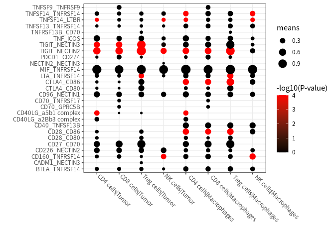

    # plot for co-inhibitory
    meansdf = mymeans %>% dplyr::filter(interacting_pair %in% coinhibitory) %>%
      dplyr::select(c("interacting_pair","CD4 cells|Tumor","CD8 cells|Tumor","Treg cells|Tumor","NK cells|Tumor",
                      "CD4 cells|Macrophages","CD8 cells|Macrophages","Treg cells|Macrophages","NK cells|Macrophages"))  %>%  
      reshape2::melt() 
    colnames(meansdf)<- c("interacting_pair","CC","means")
    meansdf$joinlab <- paste0(meansdf$interacting_pair,"_",meansdf$CC)
    
    pvalsdf = mypvals %>% dplyr::filter(interacting_pair %in% coinhibitory)%>%
      dplyr::select(c("interacting_pair","CD4 cells|Tumor","CD8 cells|Tumor","Treg cells|Tumor","NK cells|Tumor",
                      "CD4 cells|Macrophages","CD8 cells|Macrophages","Treg cells|Macrophages","NK cells|Macrophages"))%>%  
      reshape2::melt()
    colnames(pvalsdf)<- c("interacting_pair","CC","pvals")
    pvalsdf$joinlab <- paste0(pvalsdf$interacting_pair,"_",pvalsdf$CC)
    
    ccInter <- merge(pvalsdf,meansdf,by = "joinlab")
    summary(ccInter$means)
    
    ##    Min. 1st Qu.  Median    Mean 3rd Qu.    Max. 
    ## 0.00000 0.02775 0.10650 0.17020 0.23875 1.15700
    
    ccInter%>% dplyr::filter(means > 0.1) %>% 
      ggplot(aes(CC.x,interacting_pair.x) )+ 
      geom_point(aes(size=means,colour= -log10(pvals+0.0001))) +
      scale_color_continuous(name=c("-log10(P-value)"),low = "black", high = "red")+
      theme_bw()+ labs(x="",y="")+
      theme(axis.text.x = element_text(angle = -45,hjust = -0.1,vjust = 0.8))

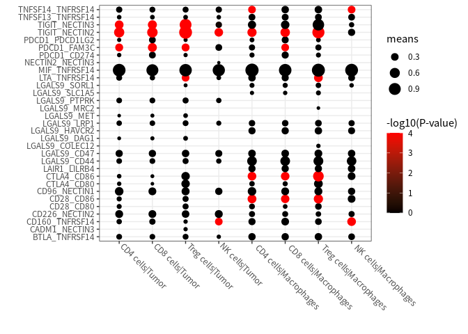

We identified a prominent co-inhibitory signal via the *TIGIT-NECTIN2* axis in T cells and antigen-presenting cells (APCs, i.e. macrophages and tumor cells):

    FeaturePlot(cleanSeurats, features = c("TIGIT","NECTIN2"))

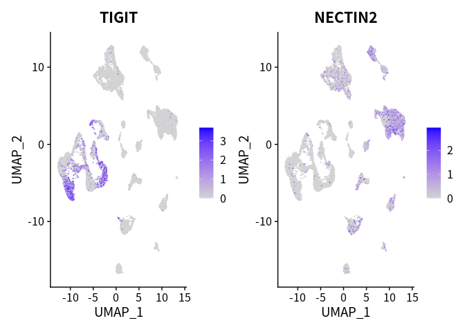

### Cell interactions

We evaluated the degree of cell-cell communication according to
different ligand-receptor relationships.  
The tumor cells contributing ligands, tumor cells contributing
receptors, TAMs contributing ligands and TAMs contributing receptors are
presented as :

    # plot for tumor ligand
    meansdf = mymeans %>% dplyr::select("interacting_pair",starts_with("Tumor")) 
    meansdf = meansdf[!duplicated(meansdf$interacting_pair),]
    row.names(meansdf) = meansdf$interacting_pair
    meansdf = as.matrix(meansdf[,-1])
    pvalsdf = mypvals[!duplicated(mypvals$interacting_pair),]
    row.names(pvalsdf) = pvalsdf$interacting_pair
    pvalsdf = pvalsdf[row.names(meansdf),colnames(meansdf)]
    meansdf = meansdf[apply(pvalsdf,1,function(x) { sum(x<0.05)>3}),]
    pheatmap::pheatmap(meansdf)

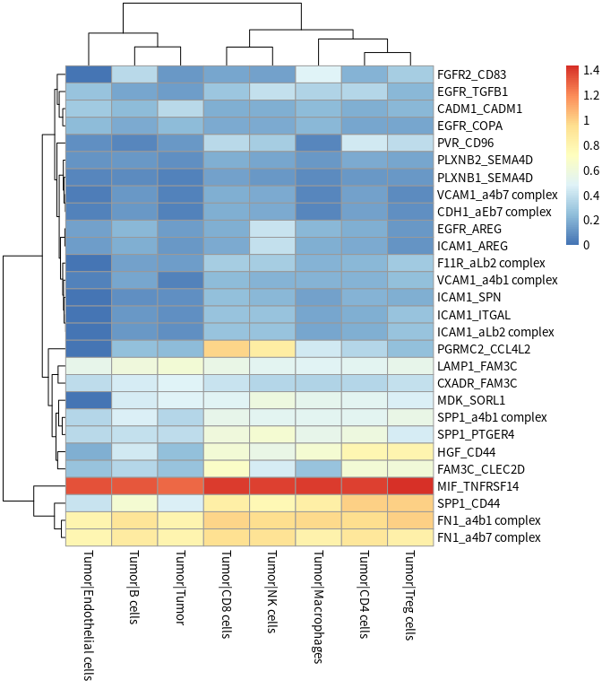

    # plot for tumor receptor
    meansdf = mymeans %>% dplyr::select("interacting_pair",ends_with("Tumor")) 
    #meansdf = meansdf[!str_detect(meansdf$interacting_pair,pattern=" "),] 
    meansdf = meansdf[!duplicated(meansdf$interacting_pair),]
    row.names(meansdf) = meansdf$interacting_pair
    meansdf = as.matrix(meansdf[,-1])
    pvalsdf = mypvals[!duplicated(mypvals$interacting_pair),]
    row.names(pvalsdf) = pvalsdf$interacting_pair
    pvalsdf = pvalsdf[row.names(meansdf),colnames(meansdf)]
    meansdf = meansdf[apply(pvalsdf,1,function(x) { sum(x<0.05)>3}),]
    pheatmap::pheatmap(meansdf)

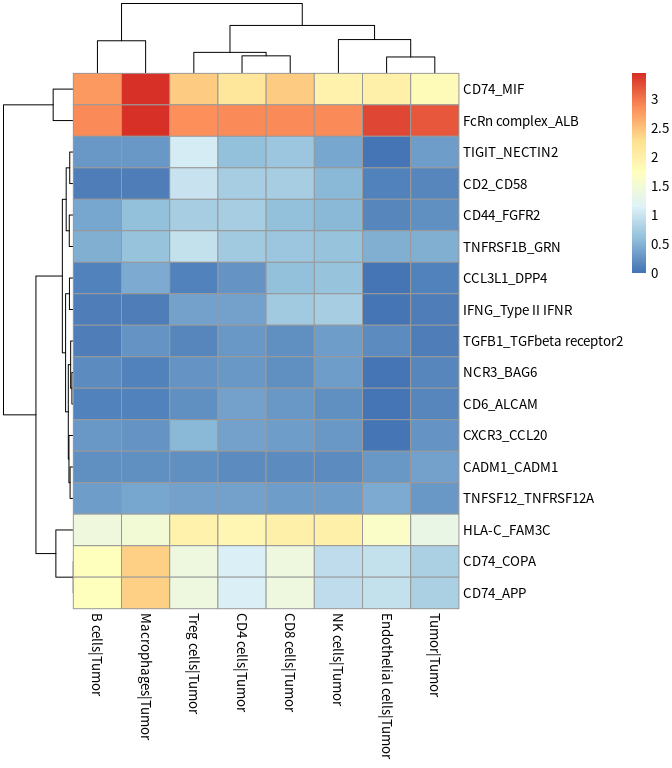

    #plot for TAM ligand
    meansdf = mymeans %>% dplyr::select("interacting_pair",starts_with("Macrophages")) 
    #meansdf = meansdf[!str_detect(meansdf$interacting_pair,pattern=" "),] 
    meansdf = meansdf[!duplicated(meansdf$interacting_pair),]
    row.names(meansdf) = meansdf$interacting_pair
    meansdf = as.matrix(meansdf[,-1])
    pvalsdf = mypvals[!duplicated(mypvals$interacting_pair),]
    row.names(pvalsdf) = pvalsdf$interacting_pair
    pvalsdf = pvalsdf[row.names(meansdf),colnames(meansdf)]
    meansdf = meansdf[apply(pvalsdf,1,function(x) { sum(x<0.05)>3}),]
    pheatmap::pheatmap(meansdf)

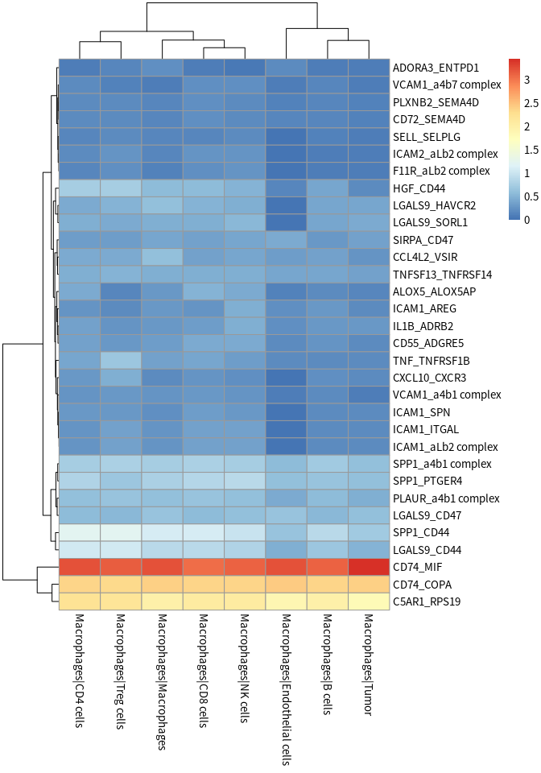

    # plot for TAM receptor
    meansdf = mymeans %>% dplyr::select("interacting_pair",ends_with("Macrophages")) 
    #meansdf = meansdf[!str_detect(meansdf$interacting_pair,pattern=" "),] 
    meansdf = meansdf[!duplicated(meansdf$interacting_pair),]
    row.names(meansdf) = meansdf$interacting_pair
    meansdf = as.matrix(meansdf[,-1])
    pvalsdf = mypvals[!duplicated(mypvals$interacting_pair),]
    row.names(pvalsdf) = pvalsdf$interacting_pair
    pvalsdf = pvalsdf[row.names(meansdf),colnames(meansdf)]
    meansdf = meansdf[apply(pvalsdf,1,function(x) { sum(x<0.05)>3}),]
    pheatmap::pheatmap(meansdf)

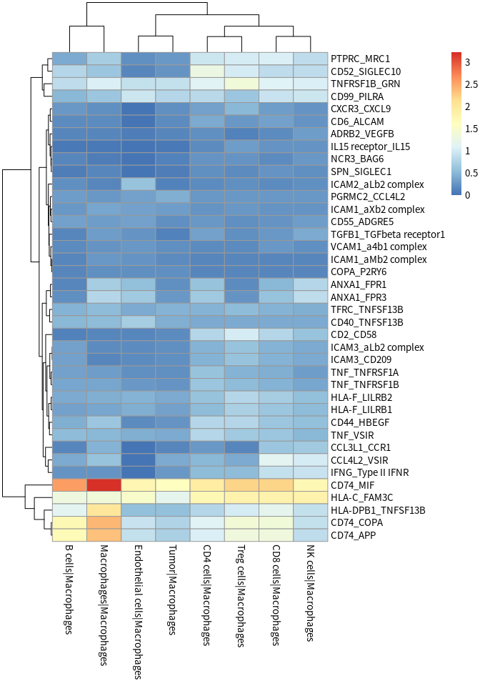

In general, HCC tumor cells frequently interacted with immune cells.

### Subclonal heterogeneity

The unsupervised hierarchical clustering of LCSC markers is shown as
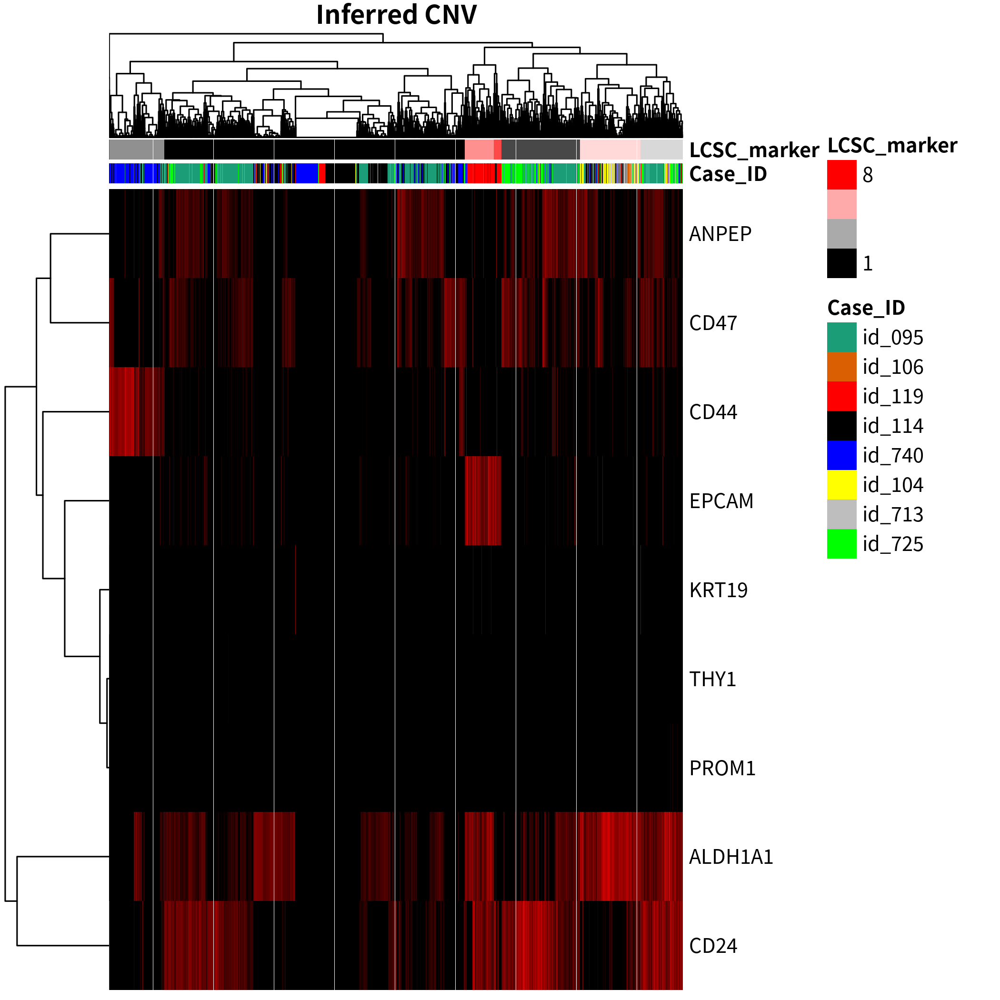.  
All cells are split into 7 clusters, one of which including 6 cells can be ignored: 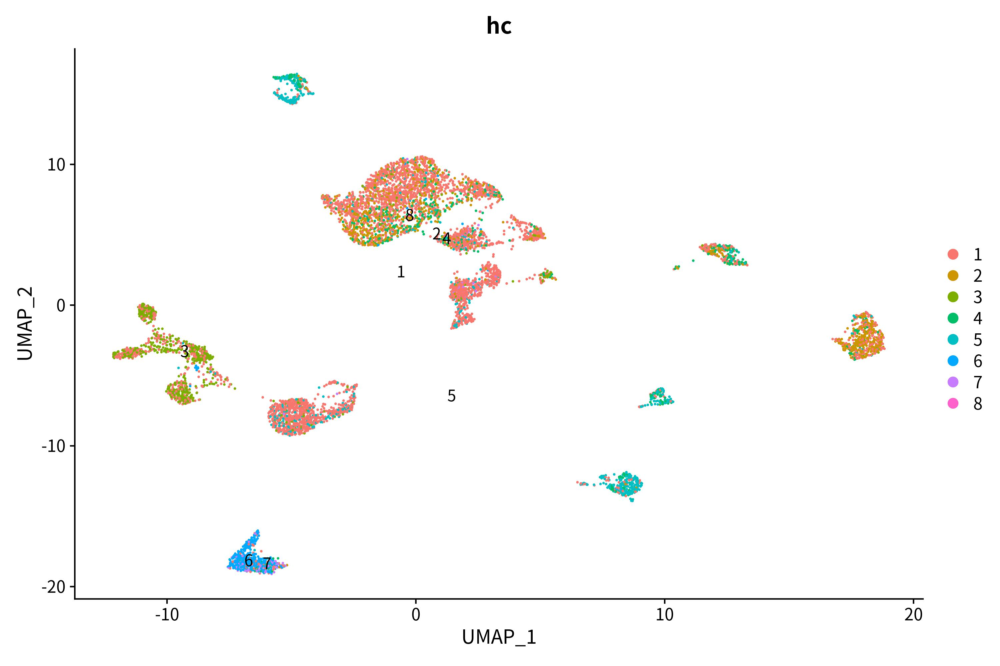  
We find that the modest correlation between case identity and LCSC marker group status.

To further explore the heterogeneity landscape of HCC tumor cell, the CNV status is inferred using infercnv package.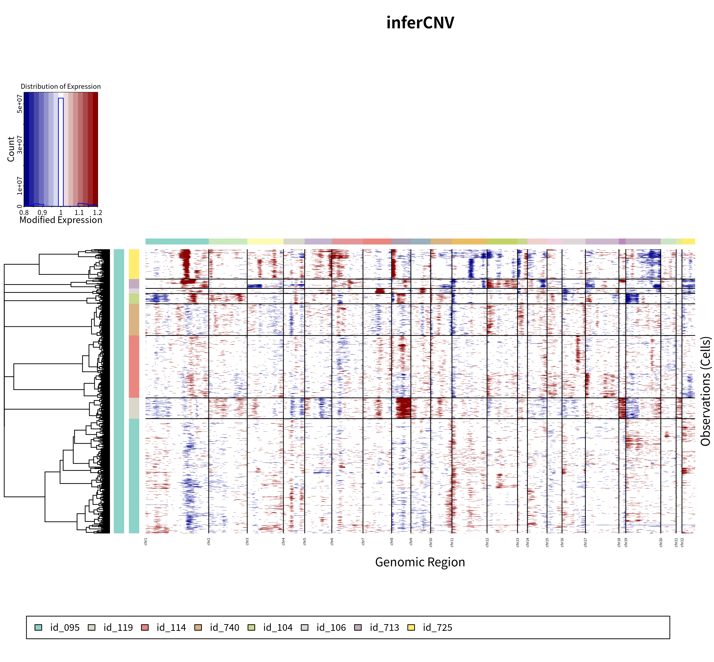  
The results showed that there are 9 major group of HCC tumor cells.
These cells from 9 major group are clustered together according to their case identify.

## Idea

1.  to research molecular mechanism of key gene based on conditional knockout mice, regrading their basic structure and function, novelty, and unique expressed in certain cell.  
2.  using new technology to sequence the HCC sample, such as spatial single RNA-seq technology.
