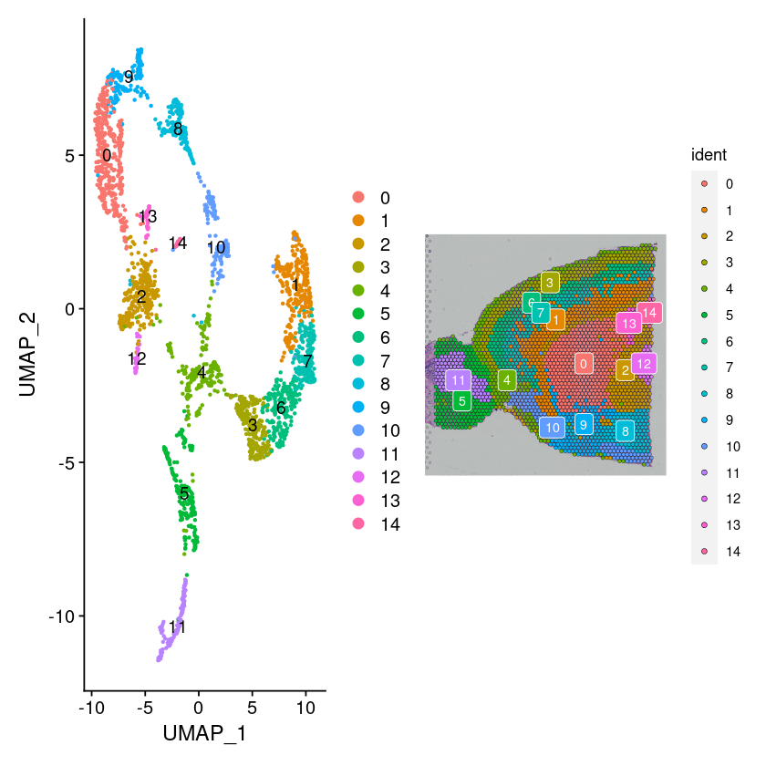

```R
# Analysis, visualization, and integration of spatial datasets with Seurat at https://satijalab.org/seurat/articles/spatial_vignette.html
# set path ------------------------------------------
rm(list=ls());options(stringsAsFactors=FALSE)
project_dir <- rprojroot::find_rstudio_root_file()
raw_dir <- paste0(project_dir,"/raw-data/")
process_dir <- paste0(project_dir,"/process-data/")
output_dir <- paste0(project_dir,"/output-results/")
temp_dir <- paste0(project_dir,"/temp-data/")
bin_dir <- paste0(project_dir,"/bin/")
script_dir <- paste0(project_dir,"/workflow-scripts/")
work_dir <- output_dir
setwd(work_dir)

# library and set default parameter  ----------------
library(tidyverse)
library(Seurat)
library(SeuratData) #devtools::install_github('satijalab/seurat-data')
library(patchwork)
library(edgeR)
library(SingleCellExperiment)
prefix <- "Seurat-3-"
output_prefix <- paste0(output_dir,prefix)
```

##  创建一些函数

```R
# functions -------------
run_clustering <- function(data, resolution = 0.1, npcs=30) {
    
  data <- SCTransform(data, assay = "Spatial", verbose = TRUE)
  data <- RunPCA(data, assay = "SCT", verbose = TRUE)
  data <- FindNeighbors(data, reduction = "pca", dims = 1:npcs)
  data <- FindClusters(data, verbose = TRUE, resolution=resolution)
  data <- RunUMAP(data, dims = 1:npcs)
  return(data)
}

pooling_seu <- function(seu_obj,assay="SCT") {
  cell_metadata <- seu_obj@meta.data
  
  # create sudo id by random sample into 3 sets from each patients
  cell_metadata$sudo_sample_id <- NA
  samples <- unique(cell_metadata$orig.ident)
  nrg <- 3
  for(i in c(1:length(samples))){
    set.seed(i)
    temp_sample_idx <- which(cell_metadata$orig.ident==samples[i])
    sample_sudo_idx <- sample(c(1:nrg),length(temp_sample_idx),replace=T,prob=rep(1/nrg,nrg)) # random sample into 3 sets
    cell_metadata[temp_sample_idx,'sudo_sample_id'] <- paste(samples[i],sample_sudo_idx,sep='_')
  }
  sce <- SingleCellExperiment(assays = list(counts = GetAssayData(seu_obj,slot="count",assay=assay)), colData = cell_metadata)
  summed <- scuttle::aggregateAcrossCells(sce, id=colData(sce)[,'sudo_sample_id']) # aggregate counts by id
  return(summed)
}

dga_treat <- function(DGEList,ref_level=NA,set_regulate=TRUE){
  DGEList$samples$lib.size <- colSums(DGEList$counts)
  if(is.na(ref_level)){
    DGEList$samples$group <- relevel(DGEList$samples$group, ref = levels(DGEList$samples$group)[1] ) 
  } else{
    DGEList$samples$group <- relevel(DGEList$samples$group, ref = ref_level)
  }
  keep <- filterByExpr(DGEList, group=DGEList$samples$group)   #set your own threshold
  table(keep)
  DGEList <- DGEList[keep,, keep.lib.sizes=FALSE]
  DGEList <- calcNormFactors(DGEList)
  # DE
  design <- model.matrix(~DGEList$samples$group)
  DGEList <- estimateDisp(DGEList, design, robust=TRUE)
  fit <- glmQLFit(DGEList, design, robust=TRUE)
  #lrt <- glmQLFTest(fit, coef=ncol(fit$design))
  lrt <- glmTreat(fit, coef=ncol(fit$design), lfc=log2(1.2))
  print(table(decideTests(lrt)))
  res <- topTags(lrt,n = nrow(DGEList))
  if(set_regulate){
    res$table$regulate <- "Normal"
    res$table$regulate[res$table$logFC>0 & res$table$FDR<0.05] <- "Up"
    res$table$regulate[res$table$logFC<0 & res$table$FDR<0.05] <- "Down"
    res$table <- res$table[order(res$table$FDR),]
  }
  return(res)
}

plot_rctd <- function(RCTD,seu_obj, image_name="VLP43_kidney_A1",r=3){
  stopifnot("RCTD"%in% class(RCTD))
  stopifnot("FindClusters"%in% names(seu_obj@commands))
  norm_weights <- normalize_weights(RCTD@results$weights) # normalize the cell type proportions to sum to 1.
  query <- subset(seu_obj,cells = row.names(RCTD@spatialRNA@coords))
  pos <- RCTD@spatialRNA@coords
  annot <- query$seurat_clusters
  p <- vizAllTopics(as.matrix(norm_weights), pos,
                    #topicCols = qualitative_hcl(n=ncol(norm_weights),palette="Dynamic"),
                    topicCols = brewer.pal(n=ncol(norm_weights),name = "Paired"),
                    groups = annot,
                    group_cols = rainbow(length(levels(annot))),
                    #group_cols = rainbow_hcl(length(levels(annot))),
                    r=r,lwd = 0.1) + labs(title=image_name) +
    #ggplot2::guides(colour = "none") +
    theme(plot.background = ggplot2::element_rect(fill = "white"),plot.title = element_text(hjust = 0.5,size=15))
  return(p)
}
```

## Visium空间转录组技术

当前时代的空间转录组技术大致分为五类方向：激光显微切割（laser capture microdissection，LCM），单分子荧光原位杂交（single molecular fluorescent in situ hybridization, smFISH），靶向原位测序（In situ sequencing，ISS），原位阵列捕获（In situ array capture, Array） 和 其他非成像技术（No imaging）。 

目前商业用的最广的还是Visium平台，因此我们以Visium数据为例进行演示，进行如聚类，差异表达，反卷积等分析。使用的工具是Seurat，spacexr等包。在单细胞下游分析中，Seurat是一个非常强大的R包，不仅有强大的社区、详细文档说明还有很多内置数据。这里以[Analysis, visualization, and integration of spatial datasets with Seurat ](https://satijalab.org/seurat/articles/spatial_vignette.html)数据为例进行空间转录组分析。

## 1. 数据探索

查看测序数据质量，是否符合生物学背景。如果质量不好，需要进行质量控制。`stxBrain`已经是过滤后的数据，我们不需要进行质量控制。


```R
#InstallData("stxBrain") # 如果由于网络问题，安装失败。可以将url放在浏览器中下载tar.gz文件，然后本地安装。
brain <- LoadData("stxBrain", type = "anterior1")

# Data preprocessing: Normalization 
plot1 <- VlnPlot(brain, features = "nCount_Spatial", pt.size = 0.1) + NoLegend()
plot2 <- SpatialFeaturePlot(brain, features = "nCount_Spatial") + theme(legend.position = "right")
wrap_plots(plot1, plot2)
# 斑点上分子计数的变化不仅是技术上的问题，而且还取决于组织的解剖结构。
# 例如，神经元（例如皮质白质）耗竭的组织区域可再现地显示出较低的分子数。
```


​    

​    

## 2. 聚类

和单细胞数据类似，我们需要对数据进行聚类。也可以使用`run_clustering`函数。


```R
brain <- SCTransform(brain, assay = "Spatial", verbose = FALSE)
# Gene expression visualization
SpatialFeaturePlot(brain, features = c("Hpca", "Ttr"))
p1 <- SpatialFeaturePlot(brain, features = "Ttr", pt.size.factor = 1)
p2 <- SpatialFeaturePlot(brain, features = "Ttr", alpha = c(0.1, 1))
p1 + p2

# Dimensionality reduction, clustering 
brain <- RunPCA(brain, assay = "SCT", verbose = FALSE)
brain <- FindNeighbors(brain, reduction = "pca", dims = 1:30)
brain <- FindClusters(brain, verbose = FALSE)
brain <- RunUMAP(brain, reduction = "pca", dims = 1:30)

# visualization
p1 <- DimPlot(brain, reduction = "umap", label = TRUE)
p2 <- SpatialDimPlot(brain, label = TRUE, label.size = 3)
p1 + p2
```


    

    

## 3. 检测亚群特异和空间特异差异基因

对不同亚群进行差异分析，对不同空间分布中的细胞进行基因差异分析。


```R
# Detecting spatially-variable features 
de_markers <- FindMarkers(brain, ident.1 = 5, ident.2 = 6)
head(de_markers)
SpatialFeaturePlot(object = brain, features = rownames(de_markers)[1:3], alpha = c(0.1, 1), ncol = 3)
```

<table class="dataframe">
<caption>A data.frame: 6 * 5</caption>
<thead>
	<tr><th></th><th scope=col>p_val</th><th scope=col>avg_log2FC</th><th scope=col>pct.1</th><th scope=col>pct.2</th><th scope=col>p_val_adj</th></tr>
	<tr><th></th><th scope=col>&lt;dbl&gt;</th><th scope=col>&lt;dbl&gt;</th><th scope=col>&lt;dbl&gt;</th><th scope=col>&lt;dbl&gt;</th><th scope=col>&lt;dbl&gt;</th></tr>
</thead>
<tbody>
	<tr><th scope=row>Calb2</th><td>6.427214e-69</td><td> 3.336874</td><td>1.000</td><td>0.537</td><td>1.135560e-64</td></tr>
	<tr><th scope=row>Camk2n1</th><td>1.519204e-68</td><td>-2.450388</td><td>1.000</td><td>1.000</td><td>2.684130e-64</td></tr>
	<tr><th scope=row>Nrgn</th><td>1.573095e-68</td><td>-3.229826</td><td>0.971</td><td>1.000</td><td>2.779344e-64</td></tr>
	<tr><th scope=row>Stx1a</th><td>2.104119e-68</td><td>-2.238353</td><td>0.784</td><td>1.000</td><td>3.717558e-64</td></tr>
	<tr><th scope=row>Nptxr</th><td>9.820482e-68</td><td>-1.918293</td><td>0.942</td><td>1.000</td><td>1.735083e-63</td></tr>
	<tr><th scope=row>Lingo1</th><td>2.124777e-67</td><td>-1.913281</td><td>0.880</td><td>1.000</td><td>3.754056e-63</td></tr>
</tbody>
</table>


    


```R
#在没有预注释的情况下搜索表现出空间模式的特征
brain <- FindSpatiallyVariableFeatures(brain, assay = "SCT", features = VariableFeatures(brain)[1:1000],selection.method = "moransi") # moransi mothed, markvariogram too slow
#top.features <- head(SpatiallyVariableFeatures(brain, selection.method = "moransi"), 6)
top.features <- c("Calb2","Gng4","Ttr","S100a5","Nrgn","Doc2g")
SpatialFeaturePlot(brain, features = top.features, ncol = 3, alpha = c(0.1, 1))

```

    Computing Moran's I


    

## 4. 检测分组特异差异基因

由于此数据没有分组信息，我们导入另一个数据进行演示。由于直接对分组细胞进行差异分析会造成假阳性，这里我们用psudo-bulk差异分析


```R
brain <- readRDS("/media/zhangfeng/myData/projects/sp-aging/output-results/70-visium-brain-cluster.RData")
```


```R
# DEG group--------
table(brain@meta.data$group)
summed <- pooling_seu(brain)
class(summed)
head(summed@colData)
is_ribo<-grepl('Rps|Rpl',row.names(summed))
is_mito<-grepl('mt-',row.names(summed))
y <- DGEList(counts(summed)[(!is_ribo)&(!is_mito),], samples=colData(summed)$sudo_sample_id,group=colData(summed)$group) # DE between types
res <- dga_treat(DGEList=y,ref_level = "young")
head(res$table)
```


​     aged young 
​    10715 11479 


    DataFrame with 6 rows and 11 columns
                orig.ident nCount_Spatial nFeature_Spatial       group nCount_SCT
               <character>      <numeric>        <integer> <character>  <numeric>
    VLP40_1A_1    VLP40_1A             NA               NA       young         NA
    VLP40_1A_2    VLP40_1A             NA               NA       young         NA
    VLP40_1A_3    VLP40_1A             NA               NA       young         NA
    VLP40_1B_1    VLP40_1B             NA               NA       young         NA
    VLP40_1B_2    VLP40_1B             NA               NA       young         NA
    VLP40_1B_3    VLP40_1B             NA               NA       young         NA
               nFeature_SCT SCT_snn_res.0.1 seurat_clusters sudo_sample_id
                  <integer>        <factor>        <factor>    <character>
    VLP40_1A_1           NA              NA              NA     VLP40_1A_1
    VLP40_1A_2           NA              NA              NA     VLP40_1A_2
    VLP40_1A_3           NA              NA              NA     VLP40_1A_3
    VLP40_1B_1           NA              NA              NA     VLP40_1B_1
    VLP40_1B_2           NA              NA              NA     VLP40_1B_2
    VLP40_1B_3           NA              NA              NA     VLP40_1B_3
                       ids    ncells
               <character> <integer>
    VLP40_1A_1  VLP40_1A_1      1023
    VLP40_1A_2  VLP40_1A_2      1041
    VLP40_1A_3  VLP40_1A_3      1025
    VLP40_1B_1  VLP40_1B_1       915
    VLP40_1B_2  VLP40_1B_2       915
    VLP40_1B_3  VLP40_1B_3       865


```
-1     0     1 
 87 14105   203 
```


<table class="dataframe">
<caption>A data.frame: 6 * 6</caption>
<thead>
	<tr><th></th><th scope=col>logFC</th><th scope=col>unshrunk.logFC</th><th scope=col>logCPM</th><th scope=col>PValue</th><th scope=col>FDR</th><th scope=col>regulate</th></tr>
	<tr><th></th><th scope=col>&lt;dbl&gt;</th><th scope=col>&lt;dbl&gt;</th><th scope=col>&lt;dbl&gt;</th><th scope=col>&lt;dbl&gt;</th><th scope=col>&lt;dbl&gt;</th><th scope=col>&lt;chr&gt;</th></tr>
</thead>
<tbody>
	<tr><th scope=row>Lyz2</th><td>2.6841911</td><td>2.6854073</td><td>5.326010</td><td>2.446786e-17</td><td>2.992338e-13</td><td>Up</td></tr>
	<tr><th scope=row>C4b</th><td>3.0082676</td><td>3.0088154</td><td>6.819937</td><td>5.386843e-17</td><td>2.992338e-13</td><td>Up</td></tr>
	<tr><th scope=row>Itgax</th><td>3.8597675</td><td>3.9129263</td><td>1.172032</td><td>6.236203e-17</td><td>2.992338e-13</td><td>Up</td></tr>
	<tr><th scope=row>Cd52</th><td>1.3891682</td><td>1.3899204</td><td>4.541512</td><td>1.229941e-15</td><td>4.426248e-12</td><td>Up</td></tr>
	<tr><th scope=row>Pcdhb9</th><td>0.9295853</td><td>0.9301349</td><td>4.305468</td><td>2.580643e-15</td><td>7.429671e-12</td><td>Up</td></tr>
	<tr><th scope=row>Fcgr2b</th><td>1.4622417</td><td>1.4650595</td><td>2.751271</td><td>1.811064e-14</td><td>4.032808e-11</td><td>Up</td></tr>
</tbody>
</table>


## 5. Deconvolution分析

由于Visium平台的spot不是单细胞分辨率，一般有1-10个细胞，因此我们需要对其进行注释，分析不同细胞的比例。这里使用spacexr包进行分析。

```R
reference <- readRDS('/media/zhangfeng/myData/projects/sp-aging/output-results/4-brain-SCRef.rds')
# control sample
spatial_controls <- RCTD_replicates(seu_obj = brain[,brain$group=="young"])
RCTD_controls <- create.RCTD.replicates(spatial_controls$spatialRNA_replicates, reference, spatial_controls$samples, max_cores = 20)
RCTD_controls <- run.RCTD.replicates(RCTD_controls, doublet_mode = 'full')

# treatment samples
spatial_treats <- RCTD_replicates(seu_obj = brain[,brain$group=="aged"])
RCTD_treats <- create.RCTD.replicates(spatial_treats$spatialRNA_replicates, reference, spatial_treats$samples, max_cores = 20)
RCTD_treats <- run.RCTD.replicates(RCTD_treats, doublet_mode = 'full')

# add into seurat
spot_weight <- combine_weight(RCTD_controls,RCTD_treats)
meta_data <- brain@meta.data %>% rownames_to_column("spot_id") %>% 
  left_join(spot_weight,by="spot_id")
all(meta_data$spot_id==colnames(brain))  
meta_data <- column_to_rownames(meta_data,"spot_id")
brain <- AddMetaData(brain,metadata = meta_data)
saveRDS(brain,file = "/media/zhangfeng/myData/projects/sp-aging/output-results/70-visium-brain-RCTD.RData"))
```


```R
brain <- readRDS("/media/zhangfeng/myData/projects/sp-aging/output-results/70-visium-brain-RCTD.RData")
```


```R
head(brain@meta.data)
```


<table class="dataframe">
<caption>A data.frame: 6 * 17</caption>
<thead>
	<tr><th></th><th scope=col>orig.ident</th><th scope=col>nCount_Spatial</th><th scope=col>nFeature_Spatial</th><th scope=col>group</th><th scope=col>nCount_SCT</th><th scope=col>nFeature_SCT</th><th scope=col>SCT_snn_res.0.1</th><th scope=col>seurat_clusters</th><th scope=col>Astrocytes</th><th scope=col>Ependymal</th><th scope=col>Immune</th><th scope=col>Microglia</th><th scope=col>Neurons</th><th scope=col>Oligos</th><th scope=col>PeripheralGlia</th><th scope=col>Vascular</th><th scope=col>max_cell</th></tr>
	<tr><th></th><th scope=col>&lt;chr&gt;</th><th scope=col>&lt;dbl&gt;</th><th scope=col>&lt;int&gt;</th><th scope=col>&lt;chr&gt;</th><th scope=col>&lt;dbl&gt;</th><th scope=col>&lt;int&gt;</th><th scope=col>&lt;fct&gt;</th><th scope=col>&lt;fct&gt;</th><th scope=col>&lt;dbl&gt;</th><th scope=col>&lt;dbl&gt;</th><th scope=col>&lt;dbl&gt;</th><th scope=col>&lt;dbl&gt;</th><th scope=col>&lt;dbl&gt;</th><th scope=col>&lt;dbl&gt;</th><th scope=col>&lt;dbl&gt;</th><th scope=col>&lt;dbl&gt;</th><th scope=col>&lt;chr&gt;</th></tr>
</thead>
<tbody>
	<tr><th scope=row>AAACAAGTATCTCCCA-1_1_1_1</th><td>VLP40_1A</td><td> 8421</td><td>3160</td><td>young</td><td>15335</td><td>3514</td><td>3</td><td>3</td><td>0.19143611</td><td>0.0006158916</td><td>0.0049827905</td><td>0.004197530</td><td>0.3236210</td><td>0.433052200</td><td>0.011450442</td><td>0.030644049</td><td>Oligos </td></tr>
	<tr><th scope=row>AAACACCAATAACTGC-1_1_1_1</th><td>VLP40_1A</td><td>23006</td><td>5649</td><td>young</td><td>16862</td><td>5507</td><td>0</td><td>0</td><td>0.11293516</td><td>0.0013890113</td><td>0.0006617161</td><td>0.011798306</td><td>0.8054124</td><td>0.062050025</td><td>0.002048477</td><td>0.003704872</td><td>Neurons</td></tr>
	<tr><th scope=row>AAACAGAGCGACTCCT-1_1_1_1</th><td>VLP40_1A</td><td>25131</td><td>6224</td><td>young</td><td>16782</td><td>5926</td><td>0</td><td>0</td><td>0.04871926</td><td>0.0073010556</td><td>0.0026329875</td><td>0.009357506</td><td>0.9132606</td><td>0.004827619</td><td>0.002313284</td><td>0.011587694</td><td>Neurons</td></tr>
	<tr><th scope=row>AAACAGCTTTCAGAAG-1_1_1_1</th><td>VLP40_1A</td><td>35993</td><td>7074</td><td>young</td><td>16298</td><td>5253</td><td>0</td><td>0</td><td>0.05981760</td><td>0.0019247194</td><td>0.0001026660</td><td>0.013729242</td><td>0.8918254</td><td>0.007285013</td><td>0.002966418</td><td>0.022348983</td><td>Neurons</td></tr>
	<tr><th scope=row>AAACAGGGTCTATATT-1_1_1_1</th><td>VLP40_1A</td><td>37738</td><td>7220</td><td>young</td><td>16163</td><td>5196</td><td>0</td><td>0</td><td>0.05777206</td><td>0.0014648800</td><td>0.0009153018</td><td>0.007876570</td><td>0.9005069</td><td>0.023966030</td><td>0.000675534</td><td>0.006822758</td><td>Neurons</td></tr>
	<tr><th scope=row>AAACATTTCCCGGATT-1_1_1_1</th><td>VLP40_1A</td><td>14901</td><td>4544</td><td>young</td><td>15460</td><td>4544</td><td>3</td><td>3</td><td>0.13274107</td><td>0.0026031003</td><td>0.0001558520</td><td>0.006728277</td><td>0.6066684</td><td>0.218612193</td><td>0.010717393</td><td>0.021773681</td><td>Neurons</td></tr>
</tbody>
</table>


## 6. 绘图

```R
slice_id <- names(RCTD_controls@group_ids)[1]
myRCTD_full <- RCTD_controls@RCTD.reps[[1]]
p_brain <- plot_rctd(myRCTD_full,brain,image_name = slice_id)+ggtitle(slice_id)+
    theme(plot.title=element_text(hjust = 0.5))+labs(fill="Cell_Type",color="Cluster")+
    guides(colour = "none")
p_brain
```


```R

```
